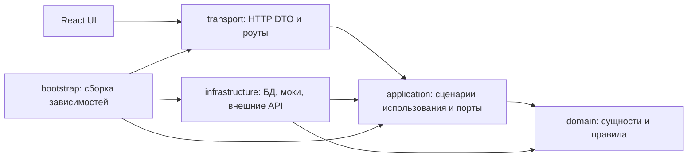

# Архитектура проекта «Альфа Защита»

Статус: проектирование, версия 1.0 от 2026-09-13. Источник требований: [TASK.md](case_brief.md). Документ задает устройство будущего кода; он не описывает уже работающую систему.

Порядок выполнения конкретных задач, отметки готовности и журнал передачи ведутся в [IMPLEMENTATION_PLAN.md](implementation_plan_v1.md). Настоящий документ остается источником архитектурных контрактов.

## Навигация

- [Суть проекта и границы](#scope)
- [Стек и направление зависимостей](#dependency-rule)
- [Файловая система](#filesystem)
- [Фичи, ответственность и будущие файлы](#feature-map)
- [Данные и форматы контрактов](#contracts)
- [Риск, состояния и защитные действия](#state-machines)
- [Сквозные потоки и согласованность](#consistency)
- [HTTP API и интеграционные порты](#api)
- [Frontend и UX](#frontend)
- [Сценарии и тестирование с пользователями](#scenarios)
- [Хранение, эксплуатация и расширение](#operations)
- [Порядок реализации и приемка](#implementation)

<a id="scope"></a>

## 1. Что строим

«Альфа Защита» связывает подозрительный внешний контакт с намерением перевести деньги: получает сигнал, анализирует содержание и доступный контекст, объясняет риск пользователю и применяет доступную меру защиты. Результат анализа должен быть понятен до завершения опасного действия.

Основной поток: **SMS / текст разговора / сообщение / ссылка → оценка риска → предупреждение → проверка перевода → остановка или продолжение → объяснение и обучение**.

У проекта два горизонта:

1. **MVP для кейса:** интерактивный web-прототип, 15 воспроизводимых сценариев, детерминированный мок ИИ, симулятор банка, пользовательское тестирование и материалы для презентации. Работает без внешних учетных записей, платных API, обучения модели и настоящих переводов.
2. **Дальнейшая система:** реальные источники коммуникаций, модели NLP/CV, банковские и операторские интеграции, обновляемая разведка угроз и обработка больших объемов данных. Архитектура резервирует границы для их подключения, но не обещает доступность API или полномочий.

Выбран web-прототип, поскольку TASK разрешает Figma или web и требует наблюдать анализ, состояния и блокировку. Figma может дополнять UX-исследование, но не является обязательной зависимостью реализации.

### 1.1. Трассировка требований

| Требование TASK | Владелец в архитектуре | Результат MVP | Условие реального подключения |
| --- | --- | --- | --- |
| Раннее выявление SMS, звонка, чата | communications + detection | Синтетический вход, расшифровка звонка, маркеры схем | Разрешенный канал получения данных; отдельный speech-to-text адаптер |
| Анализ давления и срочности | detection | Версионированные правила и объяснимые сигналы | Оцененная на независимой выборке NLP-модель |
| Фишинг по URL/скриншоту | detection + protection | Проверка URL, подготовленные изображения и CV-мок | Изолированная обработка страниц/изображений и проверенная модель |
| Поведенческий профиль | transfers + detection | Синтетическая история до текущего перевода | Доступ к истории с необходимым согласием |
| Сетевые схемы и Big Data | threats + detection | Небольшой граф связанных синтетических индикаторов | Отдельные пакетные/потоковые вычисления, качество и актуальность данных |
| Обновляемый реестр угроз | threats | Версии набора, срок действия, снятие записи, происхождение | Договоренности с поставщиками и политика верификации |
| Alfa ID и подлинность звонка | identity | Мок входа отдельно от мока аттестации звонка | Документированный источник доказательства конкретного звонка |
| Банковские/государственные/операторские API | integration ports | Явные fake-адаптеры, включая ошибки и таймауты | Подтвержденные контракты и права для каждого действия |
| Заметное предупреждение и блокировка | incidents + protection + transfers + web | Модальное предупреждение и остановка симулируемого перевода | Доступный механизм удержания/отмены в платежном потоке |
| Финансовая грамотность | education | Короткие карточки по обнаруженным схемам | Редакционная проверка и обновление материалов |
| 10–15 сценариев, мок-ассистент | scenarios + web | 15 сценариев, классификация, оценка и рекомендации | Не зависит от live-провайдеров |
| UX-метрики и презентация | research + docs | План эксперимента, события и форматы отчетов | Реальные сессии участников перед выводами о результатах |

Гипотеза снижения успешных атак на 30–50%, рост NPS и сокращение нагрузки поддержки из TASK не являются установленными результатами. UX-прототип сам по себе не измеряет эти эффекты.

### 1.2. Принятые проектные решения

- Один backend-процесс и одна БД для MVP. Бизнес-области разделены кодом и контрактами. Микросервисы и брокер сообщений не нужны для демонстрационных нагрузок.
- Браузер получает только введенные или сценарные данные. Он не читает чужие SMS, звонки и мессенджеры автоматически; интеграция с устройством — отдельный будущий источник.
- В MVP все банковские действия имеют `execution_mode=mock` и видимую пометку «Демонстрация». Реальная блокировка сайта вне приложения не изображается как выполненная.
- Мок-ИИ детерминирован: результат зависит от содержимого входа, доступного контекста и версии правил. `scenario_id` и ожидаемый ответ теста не передаются классификатору.
- Бизнес-решения принимает backend. UI получает допустимые действия и не определяет риск по цвету, ключевым словам или локальным порогам.
- Отсутствие данных и сбой проверки не означают безопасность. Статус доступности хранится отдельно от риска.
- Численные пороги, окна, лимиты и задержки ниже — исходные настройки проектирования MVP. Они подлежат проверке, а не являются банковской политикой или измеренными характеристиками.

<a id="dependency-rule"></a>

## 2. Стек и чистая архитектура

<a id="stack"></a>

### 2.1. Технологические решения

| Часть | Выбор для реализации | Причина и граница |
| --- | --- | --- |
| Backend | Python 3.11, FastAPI, Pydantic v2, Uvicorn | Существующий venv — Python 3.11; удобная граница для будущих ML-адаптеров. FastAPI/Pydantic только в transport/config |
| Бизнес-модели | Стандартная библиотека: dataclasses, enum, typing | Не зависят от HTTP, ORM и ML-библиотек |
| Хранилище MVP | SQLite, SQLAlchemy 2, Alembic | Сохранение сессий и результатов после перезапуска; один API worker, короткие транзакции |
| Тестовое хранилище | In-memory реализации портов | Быстрые изолированные тесты; не основное хранилище UX-результатов |
| Дальнейшая БД | PostgreSQL через те же repository-порты | Вводится при многопроцессной записи/реальной эксплуатации с отдельными проверками миграций и конкурентности |
| Web | React, TypeScript strict, Vite, React Router | SPA без требований SEO и серверного рендеринга; mobile-first прототип |
| Клиентские запросы | fetch + TanStack Query | Общая обработка запросов, обновление серверного состояния, короткий polling |
| Контракты клиента | OpenAPI, openapi-typescript | Типы генерируются из transport-схем backend, а не поддерживаются вручную второй раз |
| Backend-проверки | pytest, httpx, Ruff, mypy, import-linter | Поведение правил, адаптеров, HTTP, типизация и направление импортов |
| Web-проверки | Vitest, React Testing Library, Playwright, ESLint, Prettier | Состояния компонентов, контракты и сквозные сценарии |
| Стили | CSS Modules + общий набор CSS tokens | Один визуальный язык без необходимости отдельного UI-фреймворка |

На этапе проектирования зависимости не устанавливаются, lock-файлы и фиктивные manifests не создаются. Перед первым кодом выбираются совместимые точные версии; прямые и транзитивные Python-зависимости фиксируются в `apps/backend/uv.lock`, Node — в `apps/web/package-lock.json`. Python-проект описывается в `apps/backend/pyproject.toml`, frontend — в `apps/web/package.json`.

По умолчанию все Python-команды используют `/Users/Shared/github/MachineLearning/ml_venv/bin/python`. Этот venv общий: не выполнять слепой `sync`, удаляющий пакеты других проектов. Изоляция окружения CI и фиксация зависимостей проекта не меняют пользовательский venv.

FastAPI поддерживает валидацию выходной модели и отражение ее схемы в OpenAPI; это основание для единственного источника транспортных типов. [Документация FastAPI](https://fastapi.tiangolo.com/tutorial/response-model/). React поддерживает типизированные props и JSX через TypeScript. [Документация React](https://react.dev/learn/typescript).

### 2.2. Направление импортов



Стрелки внутри backend означают допустимый **импорт**, а не направление движения данных. Application вызывает методы порта; infrastructure реализует этот порт, поэтому зависимость исходного кода направлена внутрь.

| Слой | Может импортировать | Не может импортировать |
| --- | --- | --- |
| domain | stdlib, собственную фичу, `domain/shared` | application, infrastructure, transport, bootstrap, фреймворки |
| application | domain, собственные DTO/порты; workflows — публичные use cases фичей | infrastructure, transport, bootstrap, FastAPI, Pydantic, SQLAlchemy, SDK моделей |
| infrastructure | application-порты/DTO, domain, библиотеки реализации | transport, bootstrap, frontend |
| transport | application/use cases/DTO, transport-схемы и HTTP-библиотеки | infrastructure, ORM-модели, SDK провайдеров; прямое выполнение domain-политик |
| bootstrap | все backend-слои | Импорт bootstrap из бизнес-слоев запрещен |

Фичи domain не импортируют друг друга: связи представлены ID и небольшими значениями из `domain/shared`. Application-фичи не вызывают use case соседней фичи; сквозной поток собирает `application/workflows`. Общие входы/выходы портов принадлежат `application/ports`; туда не переносят бизнес-правила.

`domain/shared` ограничен ID, Money, Severity и Provenance. `application/shared` — ActorContext, Clock/IdGenerator abstractions, типизированные прикладные ошибки и пагинация. Общего BaseService, универсального CRUD repository, service locator и каталога с произвольными `utils` не вводить.

Внешний HTTP JSON → transport DTO → application command → domain value/entity; обратный путь проходит через application result и transport response. SQLAlchemy row, Pydantic model и SDK response не пересекают внутреннюю границу.

<a id="filesystem"></a>

## 3. Файловая система

Каталоги из следующего дерева созданы физически. Пустые конечные каталоги содержат только `.gitkeep`. Рабочие файлы из таблиц ниже появятся при реализации конкретной фичи. Это позволяет начать код в готовых границах без пустых классов и неработающих заглушек приложения.

```text
alpha_defense/
├── AGENTS.md
├── TASK.md
├── README.md
├── docs/
│   ├── ARCHITECTURE.md
│   ├── IMPLEMENTATION_PLAN.md
│   ├── decisions/
│   ├── research/
│   └── presentation/
├── apps/
│   ├── backend/
│   │   ├── src/alpha_defense/
│   │   │   ├── domain/
│   │   │   │   ├── shared/
│   │   │   │   ├── identity/
│   │   │   │   ├── communications/
│   │   │   │   ├── detection/
│   │   │   │   ├── incidents/
│   │   │   │   ├── protection/
│   │   │   │   ├── transfers/
│   │   │   │   ├── threats/
│   │   │   │   ├── education/
│   │   │   │   └── research/
│   │   │   ├── application/
│   │   │   │   ├── shared/
│   │   │   │   ├── ports/
│   │   │   │   ├── workflows/
│   │   │   │   ├── identity/
│   │   │   │   ├── communications/
│   │   │   │   ├── detection/
│   │   │   │   ├── incidents/
│   │   │   │   ├── protection/
│   │   │   │   ├── transfers/
│   │   │   │   ├── threats/
│   │   │   │   ├── education/
│   │   │   │   ├── research/
│   │   │   │   └── scenarios/
│   │   │   ├── infrastructure/
│   │   │   │   ├── persistence/in_memory/
│   │   │   │   ├── persistence/sqlalchemy/
│   │   │   │   ├── analysis/mock/
│   │   │   │   ├── analysis/nlp/
│   │   │   │   ├── analysis/vision/
│   │   │   │   ├── analysis/behavior/
│   │   │   │   ├── analysis/network/
│   │   │   │   ├── identity/mock/
│   │   │   │   ├── identity/alfa_id/
│   │   │   │   ├── identity/call_attestation/
│   │   │   │   ├── bank/mock/
│   │   │   │   ├── bank/open_api/
│   │   │   │   ├── threat_intel/fixtures/
│   │   │   │   ├── threat_intel/providers/
│   │   │   │   ├── notifications/in_app/
│   │   │   │   ├── notifications/operator/
│   │   │   │   ├── resources/mock/
│   │   │   │   ├── resources/providers/
│   │   │   │   ├── media/local/
│   │   │   │   ├── content/
│   │   │   │   ├── observability/
│   │   │   │   └── runtime/
│   │   │   ├── transport/http/v1/
│   │   │   └── bootstrap/
│   │   ├── migrations/versions/
│   │   └── tests/
│   │       ├── unit/
│   │       ├── application/
│   │       ├── contract/
│   │       ├── integration/
│   │       └── architecture/
│   └── web/
│       ├── public/
│       ├── src/
│       │   ├── app/
│       │   ├── pages/
│       │   ├── features/
│       │   │   ├── onboarding/
│       │   │   ├── scenario-player/
│       │   │   ├── communication-inbox/
│       │   │   ├── resource-check/
│       │   │   ├── call-verification/
│       │   │   ├── incident-details/
│       │   │   ├── risk-warning/
│       │   │   ├── protected-transfer/
│       │   │   ├── assistant/
│       │   │   ├── education/
│       │   │   └── study-feedback/
│       │   └── shared/
│       │       ├── api/generated/
│       │       ├── ui/
│       │       ├── formatting/
│       │       ├── i18n/
│       │       └── styles/
│       └── tests/
│           ├── unit/
│           ├── component/
│           └── e2e/
├── contracts/
│   ├── http/
│   ├── events/
│   ├── fixtures/
│   └── examples/
├── fixtures/
│   ├── scenarios/
│   ├── communications/
│   ├── identities/
│   ├── profiles/
│   ├── threats/
│   ├── network/
│   └── screenshots/
├── content/
│   ├── policies/
│   ├── trusted_entities/
│   ├── recommendations/
│   └── education/
├── research/
│   ├── protocols/
│   ├── instruments/
│   └── report_templates/
├── ml/
│   ├── datasets/
│   ├── experiments/
│   ├── evaluation/
│   └── model_cards/
├── ops/
│   ├── local/
│   ├── containers/
│   └── runbooks/
└── scripts/
```

<a id="supporting-directories"></a>

### 3.1. Владельцы каталогов вне бизнес-фичей

| Путь | Что сюда помещать | Формат / результат |
| --- | --- | --- |
| `docs/decisions/` | Изменения существенных решений, причины и последствия | `NNNN-short-title.md`: контекст, решение, альтернативы, влияние; текущую норму обновлять также здесь в ARCHITECTURE |
| `docs/research/` | Итоговые обезличенные выводы исследования | Markdown с источниками, выборкой, ограничениями; графики только после измерений |
| `docs/presentation/` | История проекта для защиты | `outline.md`, затем презентация/PDF; ссылки на фактические результаты |
| `contracts/http/` | Экспорт transport-контракта | Будущий `openapi.json`, генерируется, ручное редактирование запрещено |
| `contracts/events/` | Версионированные схемы событий UI и внутренних уведомлений | JSON Schema, имена `event-name.v1.schema.json` |
| `contracts/fixtures/` | Схемы входных fixture-файлов | JSON Schema: scenario, observation, profile, threat, identity, graph, content |
| `contracts/examples/` | Минимальные валидные запросы/ответы/ошибки | `.json`; проверяются по экспортированной схеме |
| `fixtures/` | Синтетические данные, ожидаемые результаты и сбои провайдеров | UTF-8 JSON; изображения PNG/WebP; подробный контракт в разделе 12 |
| `content/recommendations/` | Короткие объяснения и разрешенные действия ассистента | JSON по code + locale + version; не HTML от модели |
| `content/policies/` | Версионированные веса и ограничения демо-политики | JSON → проверенный PolicySnapshot; правила применения остаются в domain |
| `content/trusted_entities/` | Проверенные бренды, домены и контакты помощи | JSON с source/version/reviewed_at; не дополнять данными подозрительного сообщения |
| `content/education/` | Обучающие карточки | Markdown с YAML front matter, без исполняемого MDX и raw HTML |
| `research/protocols/` | План и процедура теста | Версионированный `.md`; условия, порядок сценариев, критерии включения |
| `research/instruments/` | Анкета, форма согласия исследования, кодировка ответов | `.md` и `.json`; ответы участников сюда не коммитить |
| `research/report_templates/` | Шаблон будущего отчета | Markdown; формулы, знаменатели и поля для результатов |
| `ml/datasets/` | Манифесты датасетов и схемы признаков | JSON/Markdown: источник, лицензия/условия доступа, split, hash; не сырые персональные данные |
| `ml/experiments/` | Будущие воспроизводимые исследования NLP/CV/behavior/network | Конфигурации, затем Python/ноутбуки; runtime никогда их не импортирует |
| `ml/evaluation/` | Протоколы и результаты независимой оценки | JSON + Markdown, метрики по классам, срезам и ошибкам |
| `ml/model_cards/` | Назначение, версия, ограничения каждой модели | Markdown; ссылка на артефакт и hash вместо весов в Git |
| `ops/local/` | Будущие примеры локальной конфигурации | `.env.example` без секретов; значения проверяются bootstrap |
| `ops/containers/` | Будущая упаковка приложения и БД | Dockerfile/compose только после появления запускаемого приложения |
| `ops/runbooks/` | Запуск, восстановление, сбои, миграции, очистка | Markdown с проверенными командами |
| `scripts/` | Будущие тонкие команды генерации схем, seed, проверки fixtures, экспорта исследования | Вызывают публичные application/инструментальные интерфейсы; не дублируют антифрод-правила |

Локальные БД, загруженные файлы и экспорты будут находиться в `var/` (создается во время запуска, исключается из Git). Сценарные screenshots находятся только в `fixtures/screenshots/`; web получает их через контролируемый media endpoint. `apps/web/public/` предназначен для общей статики, не для приватных вложений.

<a id="naming"></a>

### 3.2. Правила имен и размера файлов

- Python-пакеты/файлы/поля JSON — `snake_case`; TypeScript components — `PascalCase.tsx`, hooks — `useName.ts`, URL-пути — `kebab-case`.
- Один use case — один файл с конкретным именем действия, например `check_transfer.py`. `models.py` допустим внутри одной узкой domain-фичи; если сущности разрастаются, разделять по сущностям.
- Domain: `entities.py`/именованные сущности, `value_objects.py`, `policies.py`, `errors.py` только по необходимости. Не создавать эти файлы автоматически в каждой папке.
- Application: именованные use cases и `dto.py`. Порты отдельно в `application/ports/`; внешние transport-схемы отдельно в `transport/http/v1/`.
- Frontend-фича со временем получает `ui/`, `model/`, `api/` и `index.ts` только при наличии соответствующего содержимого. Публичный экспорт определяется `index.ts`; импорт внутренних файлов соседней фичи запрещен.
- Форматирование: UTF-8, LF, завершающая новая строка; Python — 4 пробела, длина строки 100, Ruff; TS/JSON/CSS — 2 пробела, Prettier. Markdown — содержательные разделы, таблицы контрактов и относительные ссылки внутри репозитория.

<a id="feature-map"></a>

## 4. Ветки бизнес-логики

В таблицах пути domain/application приведены относительно `apps/backend/src/alpha_defense/`. Файлы перечислены как будущая спецификация; код сейчас не создается.

<a id="feature-identity"></a>

### 4.1. Identity: пользователь, согласия и доверие к источнику звонка

**Пути:** `domain/identity/`, `application/identity/`. Будущие файлы: `user.py`, `consent.py`, `call_verification.py`; `start_session.py`, `update_consent.py`, `verify_call.py`, `dto.py`.

**Вход:** ActorContext от серверной сессии; изменение явно названных consent scopes; идентификатор звонка, вызываемая сторона, nonce и доказательство провайдера, если есть. **Выход:** SessionView, ConsentSnapshot, CallVerification. Пользовательский `user_id` из тела запроса не заменяет серверную идентичность.

Согласия разделены: `analyze_communications`, `analyze_resources`, `use_transaction_history`, `send_notifications`, `participate_in_research`. `send_notifications` управляет внешними каналами уведомления; необходимое объяснение перед действием внутри приложения остается частью пользовательского потока. Отказ от исследования не отключает демонстрационную защиту; отзыв анализа истории приводит к недоступности поведенческих признаков, а не к нулевой аномальности. Для MVP согласие на анализ также показывается пользователю, хотя данные синтетические.

Аутентификация через Alfa ID и доверие к **конкретному звонку** — два разных порта. CallVerification включает связь с user/call/session, issuer, issued_at, expires_at, nonce, verification_status и reason_code. `verified` возможен лишь при подходящем доверенном доказательстве; совпадение caller ID или вход в приложение этого не доказывают. В демо доказательство синтетическое и имеет provenance mock.

Публичное описание Alfa ID говорит об авторизации в сервисах; считать его готовым API защиты от спуфинга оснований в TASK нет. [Описание Alfa ID](https://alfabank.ru/everyday/alfa-id/), [введение Alfa API](https://developers.alfabank.ru/products/alfa-api/documentation/articles/specification/specification). Доступность и контракт аттестации звонка требуют отдельной проверки при интеграции.

<a id="feature-communications"></a>

### 4.2. Communications: прием и нормализация наблюдений

**Пути:** `domain/communications/`, `application/communications/`. Файлы: `observation.py`, `normalization.py`; `ingest_observation.py`, `get_observation.py`, `dto.py`.

**Вход:** ObservationInput с вариантом `sms`, `messenger`, `call_transcript` или `web_resource`. **Выход:** неизменяемый Observation, нормализованные индикаторы, результат дедупликации. Прием не делает вывод о мошенничестве и не обращается к банку.

Для текстовых каналов нужны текст, отправитель и conversation_id; для звонка — call_id, номер и расшифровка с необязательными временными сегментами; для web — URL и/или media_id скриншота. Речевые файлы в MVP не принимаются; будущий SpeechToTextPort возвращает текст и качество расшифровки в тот же поток. Накапливаемые части звонка имеют sequence и отдельные observation_id; они не перезаписывают исходные доказательства.

`source` задается доверенным входным адаптером: manual, scenario или идентификатор подключенного провайдера. Ручной клиент генерирует source_event_id до первой отправки и сохраняет его для retry. Провайдерский namespace/source нельзя присвоить себе полем JSON.

Нормализованный телефон хранится в E.164, если формат разрешим, иначе отдельно raw + `normalization_status=invalid`. URL сохраняется как исходный и нормализованный; host lowercase/IDNA, fragment исключен из ключа, path/query не уничтожаются целиком. Домены и URL являются разными типами индикаторов. Правила нормализации версионируются.

<a id="feature-detection"></a>

### 4.3. Detection: сигналы, объединение свидетельств и оценка риска

**Пути:** `domain/detection/`, `application/detection/`. Файлы: `signal.py`, `assessment.py`, `risk_policy.py`; `assess_observation.py`, `assess_transfer_context.py`, `dto.py`.

**Вход:** нормализованное наблюдение/перевод, разрешенный снимок истории, снимок угроз, проверка звонка; версии политики и анализаторов. **Выход:** RiskAssessment с признаками, основаниями, полнотой и происхождением. Ветка не создает блокировки, не принимает UI-команды и не пишет в реестр угроз.

Анализ разбит на TextAnalysisPort, ResourceAnalysisPort, BehaviorAnalysisPort, NetworkAnalysisPort. Каждый возвращает AnalysisResult с `status`, `signals`, `version`, `latency_ms`. В MVP реализации работают на правилах/небольших графах/предподготовленных CV-результатах. Свободный текст может не содержать ни одного маркера: это не техническая ошибка и не доказательство безопасности.

Сигналы: давление/срочность/секретность, просьба раскрыть код, «безопасный счет», подмена личности, подозрительная ссылка/визуальное сходство, действующий индикатор из реестра, новый получатель, необычная сумма, связь получателя с известной сетью. Сигнал хранит code, evidence_ref, strength, source, applicability. Не складывать повтор одного утверждения из нескольких источников как независимые доказательства.

<a id="feature-incidents"></a>

### 4.4. Incidents: контекст, корреляция и временная линия

**Пути:** `domain/incidents/`, `application/incidents/`. Файлы: `incident.py`, `correlation_policy.py`; `attach_observation.py`, `get_incident.py`, `resolve_incident.py`, `dto.py`.

**Вход:** ссылки на наблюдения, оценки, решения/действия, пользовательский контекст. **Выход:** Incident и IncidentView — упорядоченная временная линия с актуальной оценкой и ссылками на исторические версии. Инцидент — контейнер расследования возможной угрозы; сам факт его создания не означает установленное мошенничество.

Корреляция производится backend только внутри одного user + demo session/исследовательского trial. Приоритет: явный проверенный conversation_id/call_id → совпадение нормализованного индикатора или получателя → временное окно при наличии дополнительной связи. Одна близость времени не объединяет все контакты человека в одну атаку.

MVP-окно связи контакта с переводом — 30 минут до check, в пределах одной сессии; основание корреляции сохраняется. Поступившее позднее наблюдение может привести к новой оценке, но не меняет задним числом прежнюю версию или факт уже завершенного перевода.

<a id="feature-protection"></a>

### 4.5. Protection: предупреждения и действия против ресурса

**Пути:** `domain/protection/`, `application/protection/`. Файлы: `warning.py`, `protection_action.py`, `warning_policy.py`, `resource_gate.py`; `issue_warning.py`, `record_warning_response.py`, `request_resource_action.py`, `check_resource_navigation.py`, `get_action.py`, `dto.py`.

**Вход:** оценка риска, снимок возможностей исполнения, намерение пользователя. **Выход:** Warning, AllowedAction[], ProtectionAction и подтвержденный статус. Ветка отвечает за заметность и объяснение защиты, но не определяет платежную политику заново.

Два действия по ресурсу: `restrict_resource` в пределах приложения/симулятора; `report_resource` — заявка внешнему провайдеру. `scope=demo|in_app|provider` обязателен. Статус заявки `confirmed` означает подтверждение именно принятия заявки; не глобальное удаление сайта. Для будущего внешнего исполнения ответ должен отдельно указывать `effect=report_received|resource_restricted`.

Локальное ограничение имеет наблюдаемый эффект: шаг `open_resource` обращается к backend `check_resource_navigation` по target_indicator_id. Сохраненный ResourceGate блокирует выдачу разрешения открыть соответствующую подготовленную demo-страницу. Результат ResourceNavigationDecision содержит `allow|deny`, reason_codes, action_id?, execution_mode и optional preview_ref только для разрешенного сценарного ресурса. Произвольный внешний URL не открывается этим endpoint. Screenshot как доказательство можно посмотреть и при deny; это не переход на сайт. Gate привязан к owner/namespace и каноническому индикатору и не выключается локальным state React.

Warning содержит severity, assessment_id, причины, рекомендацию, delivery_status, response и policy_version. Закрытие диалога не является согласием на перевод и не снимает удержание. Текст предупреждения строится по утвержденным кодам рекомендаций; UI не вставляет HTML из анализа.

<a id="feature-transfers"></a>

### 4.6. Transfers: проверка намерения и исполнение в симуляторе банка

**Пути:** `domain/transfers/`, `application/transfers/`. Файлы: `transfer_intent.py`, `transfer_check.py`, `decision_policy.py`, `transfer_execution.py`; `create_transfer.py`, `check_transfer.py`, `confirm_transfer.py`, `cancel_transfer.py`, `reconcile_execution.py`, `dto.py`.

**Вход:** сумма/валюта/получатель, текущая revision намерения, контекст оценки, доступные capability банка. **Выход:** TransferIntent, неизменяемый TransferCheck, TransferExecution. Решение `allow|confirm|hold|deny` отделено от фактического банковского статуса.

Сумму, получателя и валюту связывает fingerprint намерения. Любое изменение создает новую revision, делает предыдущий check непригодным и требует проверки заново. Проверка также привязана к версии контекста инцидента, профиля и политики, а не только к введенным реквизитам.

MVP fake bank владеет собственной книгой синтетических операций: предотвращение отправки и изменение симулируемого статуса происходят на backend. UI не может «заблокировать» перевод только сменой цвета. MVP hold — немонетарный gate по transfer_id + revision, не резервирование средств. Его подтверждение имеет scope=demo_gate. Реальное банковское удержание — другая capability, для которой до подключения отдельно определяются срок, освобождение и возможное резервирование.

<a id="feature-threats"></a>

### 4.7. Threats: реестр и сетевой контекст

**Пути:** `domain/threats/`, `application/threats/`. Файлы: `indicator.py`, `threat_record.py`, `registry_policy.py`; `lookup_indicators.py`, `refresh_registry.py`, `get_registry_status.py`, `dto.py`.

**Вход:** нормализованные номера, домены, URL, кошельки, токены счетов, IP или pattern_id; пакет данных источника. **Выход:** ThreatLookupResult и атомарный RegistrySnapshot с версией/временем актуальности. Запись содержит source, status, observed_at, expires_at, evidence_ref и источник решения о подтверждении.

Статусы записи: `unverified|active|revoked|expired`. Автоматическое совпадение с шаблоном или пользовательская жалоба не активируют запись без установленного процесса проверки. Отрицательное совпадение означает «не найдено в этом снимке», не «безопасно». Просроченный/недоступный реестр отражается в completeness.

Обновление: fetch → schema validation → нормализация → устранение дубликатов → проверка версии/источника → атомарное переключение активного snapshot. Плохой пакет не заменяет последний валидный. Графовые признаки читаются из подготовленного снимка, а не рассчитываются по всей истории на горячем пути.

<a id="feature-education"></a>

### 4.8. Education: объяснение и мок-ассистент

**Пути:** `domain/education/`, `application/education/`. Файлы: `recommendation.py`, `education_card.py`; `get_guidance.py`, `list_cards.py`, `get_card.py`, `dto.py`.

**Вход:** reason_codes, текущий риск/полнота и разрешенные действия. **Выход:** GuidanceView: краткая классификация, объяснение, рекомендации и ссылки на карточки; EducationCard. Ассистент в MVP — структурированное представление этих результатов; свободного LLM-чата и выполнения команд модели нет.

Карточка содержит code, locale, version, title, summary, body, source_links, reviewed_at. Рекомендация «позвонить в банк» использует отдельно настроенный доверенный контакт, а не номер из подозрительного сообщения. Если контакта нет, текст предлагает открыть официальный банковский канал без выдуманного номера.

<a id="feature-research"></a>

### 4.9. Research: исследовательские сессии и наблюдения UX

**Пути:** `domain/research/`, `application/research/`. Файлы: `study_session.py`, `trial.py`, `ux_event.py`, `metric_definition.py`; `start_study.py`, `record_events.py`, `submit_feedback.py`, `finish_trial.py`, `export_study.py`, `dto.py`.

**Вход:** согласие на исследование, обезличенный participant_id, scenario/trial и версия условий, allowlist событий UI, ответы 1–5. **Выход:** принятые события, состояние trial, агрегаты и обезличенный экспорт. Эти события не меняют решение банка и не подменяют audit log.

Сохранять отдельно доказательство показа предупреждения, осмысленный ответ человека и автоматическую остановку системой. Не записывать сообщение целиком, номер или счет в analytics payload. Точные формулы — в разделе 13.

<a id="feature-scenarios"></a>

### 4.10. Scenarios: воспроизводимая демонстрация

**Путь:** только `application/scenarios/`; domain-аналога не требуется. Файлы: `list_scenarios.py`, `start_scenario.py`, `advance_scenario.py`, `reset_demo.py`, `dto.py`.

**Вход:** scenario_id, fixture_version, seed, действующая demo session. **Выход:** ScenarioRun с последовательностью разрешенных шагов и ссылками на созданные сущности. Сценарный движок вызывает те же workflows, что ручной ввод; не записывает готовый ответ в assessment/transfer напрямую.

Expected results доступны только тестовому harness и исследовательскому экспорту после trial. Интерфейс участника не видит label «мошенничество» до решения. Настроенный fixture-провайдер может воспроизводить timeout или известный ответ на скриншот; происхождение результата остается mock.

<a id="technical-branches"></a>

### 4.11. Workflows и технические ветки

| Ветка | Будущие файлы / обязанности | Вход → выход |
| --- | --- | --- |
| `application/workflows/` | `analyze_contact.py`, `review_transfer.py`, `execute_protection.py` | Команда пользователя → последовательность use cases, единый результат; место межфичевой координации |
| `application/ports/` | `repositories.py`, `unit_of_work.py`, `analysis.py`, `identity.py`, `bank.py`, `threat_intel.py`, `notifications.py`, `resources.py`, `content.py`, `scenarios.py`, `media.py`, `events.py` | Типизированные интерфейсы и plain DTO для инфраструктуры; методы перечислены ниже |
| `infrastructure/persistence/` | entity↔row mappers, реализации repository/UoW | Domain entity ↔ сохраненное состояние; SQL только здесь |
| `infrastructure/runtime/` | clock, ID generator, idempotency и reconciliation runner | Системное время/план исполнения → реализации application-портов |
| `infrastructure/observability/` | JSON logging, metrics, audit persistence adapter | Обезличенное событие → операционные записи, без контента сообщений |
| `transport/http/v1/` | Роуты и `schemas/` по фичам, обработчик Problem Details, session/ownership dependencies | HTTP ↔ application DTO; без решений о риске |
| `bootstrap/` | `settings.py`, `container.py`, `app.py` | Проверенная конфигурация → граф зависимостей и ASGI app; единственное место выбора mock/live |
| `migrations/versions/` | Последовательные миграции схемы | Предыдущая версия БД → новая; не выполнять в импортируемых модулях |

<a id="contracts"></a>

## 5. Форматы данных и контракты

### 5.1. Общие правила

- HTTP — JSON UTF-8. Даты — RFC 3339 UTC с `Z`; отображение времени — `Europe/Moscow`, `ru-RU`. `occurred_at`, `received_at` и `processed_at` не взаимозаменяемы.
- Все runtime ID — UUID в строке. Стабильные человекочитаемые коды fixtures (`S01`, `profile_regular`) не используются вместо runtime ID. Correlation/request ID нужны для трассировки, а не авторизации.
- Money: `amount_minor` — положительное целое в минимальных единицах, `currency` — трехбуквенный код. MVP только RUB, до 100 000 000 копеек включительно. `float` для денег запрещен. UI показывает, например, `15 000,00 ₽`; сеть получает `1500000`, `RUB`.
- Enums — стабильные английские строки. `null` означает отсутствие/неизвестность по схеме, не ноль и не пустую строку. Не применимо обозначается отдельным `not_applicable` в статусах анализатора.
- `Provenance`: `execution_mode=mock|live`, provider, provider_version, data_version. Итог дополнительно содержит `has_mock_evidence`; смешение mock/live запрещено для исполнения реальных действий.
- Транспортные schema_version и версии policy/model/content/fixture различаются. API major — `/api/v1`; несовместимые поля/enum требуют новой версии или согласованной миграции клиента.
- Входные JSON-схемы запрещают неизвестные поля и ограничивают размеры; GET-выходы явно перечисляют публичные поля. Private токены/полные банковские идентификаторы наружу не возвращаются.
- Коллекции: `{items, next_cursor}`; cursor непрозрачный, default limit 20, max 100, порядок `(created_at, id)`. Пустая выдача — `items=[]`, `next_cursor=null`.
- Пример/fixture — валидный JSON без комментариев. Секреты и реальные номера в примерах запрещены. URL примеров используют `.test`/`.invalid`, счета — синтетические токены.

<a id="data-models"></a>

### 5.2. Основные объекты

Таблица задает обязательную семантику полей. `?` означает необязательное nullable-поле. Системные `id`, `created_at`, ownership и provenance добавляются к сохраняемым объектам согласно их назначению; это не универсальная domain-базовая модель.

| Объект | Поля и формат | Инварианты |
| --- | --- | --- |
| ActorContext | user_id, session_id, namespace_id, roles[], consent_revision, execution_mode | Создается сервером; namespace ручного ввода или scenario run; client input не может расширить роли |
| ConsentSnapshot | scope, status `granted\|revoked`, revision, changed_at | Проверяется при новом анализе и перед внешней передачей |
| ObservationInput | kind, source_event_id, occurred_at, payload (tagged union), conversation_id? | Тело зависит от kind; принадлежность существующего conversation проверяется |
| Observation | observation_id, owner, received_at, normalized_indicators[], media_refs[], content_ref, normalization_version | Исходный контент неизменяем; raw хранится отдельно от логов |
| CallVerification | call_id, status, issuer?, subject_binding?, issued_at?, expires_at?, evidence_ref?, reason_code | Доверие ограничено конкретным звонком и сроком; номер сам по себе не proof |
| AnalysisResult | analyzer, status `ok\|unavailable\|timeout\|not_applicable\|insufficient_data`, signals[], model_version?, latency_ms | При недоступности signals не трактуются как отрицательная проверка |
| RiskAssessment | assessment_id, target_kind/id, severity, score?, score_kind, completeness, signals[], reason_codes[], analyzer_results[], policy_version, assessed_at, context_version, provenance | Неизменяем; score не равен вероятности мошенничества |
| Incident | incident_id, owner, status, observation_ids[], latest_assessment_id?, context_version, resolution? | Рост context_version при новом релевантном свидетельстве; прежние оценки остаются |
| Warning | warning_id, incident_id, assessment_id, severity, reason_codes[], recommendation_codes[], delivery_status, response?, presented_at?, responded_at? | presented подтверждается UI, acknowledged не снимает hold |
| AllowedAction | code, enabled, disabled_reason?, requires_confirmation, target_id, target_revision | Серверный снимок возможностей; исполнение перепроверяет их |
| TransferIntent | transfer_id, owner, revision, recipient_token, recipient_display, Money, fingerprint, lifecycle, created_at | Клиент не меняет owner/status/fingerprint; редактирование только draft |
| TransferCheck | check_id, transfer_id, transfer_revision, fingerprint, assessment_id, context_version, evaluation_context, decision, reason_codes[], allowed_actions[], policy_version, expires_at | TTL максимум 120 секунд, не позже срока пригодности доказательств; пригодность проверяется при исполнении |
| TransferExecution | execution_id, transfer_id, target_revision, fingerprint, check_id?, kind `submit\|hold\|cancel`, scope `demo_gate\|local\|provider`, state, execution_mode, provider_ref?, effect?, bank_operation_id?, last_checked_at? | check_id обязателен для submit/hold, может отсутствовать при локальном cancel; один active execution на перевод |
| BankOperation | bank_operation_id, transfer_id, provider_ref, status `accepted\|processing\|settled\|declined\|cancelled\|unknown`, status_at, execution_mode | Принятие submit не равно settled; окончательный исход меняет lifecycle намерения |
| ProtectionAction | action_id, incident_id, kind `restrict_resource\|report_resource`, scope, state, evidence_ref?, effect?, provider_ref? | Scope и effect не дают назвать локальную меру глобальной блокировкой |
| ThreatRecord | indicator_type, normalized_value/token, source, source_record_id, status, first_seen_at, observed_at, expires_at, evidence_ref | Уникальность по source + source_record_id; match key типизирован |
| RegistrySnapshot | snapshot_id, version, source_versions[], published_at, valid_until, record_count | Не частично опубликованный набор; только прошедшие валидацию данные |
| BehaviorProfile | profile_id, user_id, as_of, window_start, sample_size, known_recipients[], amount_summary, feature_version | Только история до проверяемой операции; sample_size влияет на пригодность |
| GuidanceView | classification, risk_label, explanation, recommendations[], education_card_ids[], allowed_actions[], content_version | Отдельные факты, ограничения и совет; нет обещаний гарантированной защиты |
| StudySession / Trial | study_id, participant_id, consent_id, protocol_version, primary_trial_id; trial_id, scenario_id/version, condition, is_primary_trial, started_at, ended_at?, completion_status | Primary назначен до эксперимента; технический replay не считается новым участником |
| UxEvent | event_id, study_id, trial_id, event_name, occurred_at, received_at, client_timebase_id, elapsed_ms, sequence, schema_version, payload | event_id уникален; длительности только внутри одной временной базы, время клиента не управляет переводом |

`RiskAssessment.completeness=complete|partial|unavailable`; `severity=low|medium|high|critical|unknown`. При отсутствии пригодных анализаторов — `unavailable + unknown + score=null`. При частичной проверке допустим высокий риск по имеющимся основаниям; неполнота не скрывается. `score_kind=heuristic` у демо-правил. Калиброванная probability-модель в будущем должна иметь отдельный явно названный результат.

Применимость задает versioned analysis plan: для текстового наблюдения обязательны text и lookup извлеченных индикаторов; для web — resource и lookup, CV только при наличии screenshot; для перевода — behavior, lookup получателя, network и доступный связанный контактный контекст. Нет индикаторов/скриншота/контакта — соответствующий анализ `not_applicable`, он не уменьшает completeness. Для звонка, заявленного как банковский, недоступность аттестации отражается в полноте; неверный или истекший proof дает результат проверки `ok` с бизнес-статусом unverified/expired. Отозванный scope или недостаток требуемой истории не превращаются в not_applicable: это partial/insufficient_data. Complete означает, что все применимые проверки завершены, а не что объект безопасен.

`signals[].evidence_ref` указывает на принадлежащее владельцу наблюдение, threat record или профиль, а не содержит полный текст. Фрагменты объяснения ограничены и экранируются; UI показывает не больше трех основных причин и раскрывает остальные по запросу.

`evaluation_context`: namespace_id, ingress_risk_epoch, incident context_version, history_snapshot_id/as_of, registry_snapshot_id, graph_snapshot_id, consent_revision, call_proof_id/expiry?, analysis_plan_version, policy_version и hash этих значений. `expires_at` check — минимум TTL политики и сроков применимых свидетельств. Публикация нового реестра/профиля, отзыв scope, смена proof/policy или неразрешенный релевантный анализ аннулируют пригодность check. Если истории/снимка нет, это явный null + status, а не отсутствующий элемент сравнения.

<a id="input-limits"></a>

### 5.3. Лимиты входов MVP

| Вход | Лимит / валидация |
| --- | --- |
| sms/messenger text | 10 000 Unicode символов; пустая строка после trim недопустима |
| call_transcript | 30 000 символов; до 200 сегментов с возрастающим sequence |
| URL | До 2048 символов, только http/https; схема обязательна; отображение обезврежено |
| Screenshot | PNG/WebP, до 5 MiB и 16 мегапикселей; MIME + декодирование, без SVG |
| indicators per observation | До 50; остальное — явная ошибка лимита, не молчаливое усечение |
| UX batch | До 100 событий; тело до 256 KiB; каждое событие по своей схеме |
| timestamps | Будущее дальше 5 минут отклоняется; сценарные часы инъецируются только demo workflow |

MVP media endpoint принимает только разрешенное изображение и возвращает media_id. Никакого произвольного скачивания внешнего URL на backend. Подготовленный screenshot и URL являются независимыми свидетельствами; внешнее содержимое сайта не считается автоматически прочитанным.

<a id="state-machines"></a>

## 6. Политика риска и реакции

<a id="risk-policy"></a>

### 6.1. Начальная демо-политика

Шаблоны извлечения сигналов принадлежат мок-анализатору; их версия — analyzer_version. Веса и итоговая интерпретация принадлежат domain risk policy, входной набор весов загружает bootstrap через проверенный PolicySnapshot. Будущая конфигурация `content/policies/demo-risk-v1.json` содержит policy_version, каталог signal codes и численные настройки. Ее JSON Schema располагается в `contracts/fixtures/`; domain не читает файл. Registry_version хранится в контексте оценки отдельно от версии правил.

Предлагаемая шкала MVP: low 0–24, medium 25–49, high 50–79, critical 80–100. Это **условные баллы**, а не вероятность. Балл определяется максимальным базовым сигналом плюс ограниченными модификаторами из независимых групп; повтор сигнала с одним evidence_ref веса не добавляет.

Каталог демо-политики v1:

| Signal code | Основание, которое должен вернуть анализатор | Базовый балл |
| --- | --- | --- |
| `urgency_or_secrecy` | Срочность или требование скрыть разговор; без иных признаков | 15 |
| `prize_fee_request` | Для получения выигрыша требуется предварительная оплата | 30 |
| `delivery_fee_request` | Сообщение предлагает оплатить доставку/возврат через присланную ссылку | 30 |
| `relative_emergency_payment` | Просьба перевести деньги от имени родственника в чрезвычайной ситуации | 45 |
| `lookalike_domain` | Домен имитирует бренд по нормализованному сравнению, не входит в trusted catalog | 45 |
| `credential_request` | Просьба раскрыть одноразовый код/пароль или ввести его на подозрительном ресурсе | 55 |
| `visual_brand_imitation` | CV-мок обнаружил имитацию банковской страницы в предоставленном изображении | 55 |
| `safe_account_transfer` | Требование перевести средства на якобы безопасный счет | 60 |
| `active_threat_match` | Точное применимое совпадение типизированного индикатора с active, непросроченной записью | 85 |
| `new_recipient` | Получателя нет в доступной истории | 15 |
| `known_recipient_amount_outlier` | Известный получатель, сумма ≥3 медиан при пригодной истории | 30 |
| `new_recipient_amount_outlier` | Новый получатель и сумма ≥3 медиан при пригодной истории | 50 |
| `active_fraud_network_link` | Версионированный graph snapshot содержит установленную в fixture связь с активной сетью | 80 |

Алгоритм: взять максимальный базовый балл, при отсутствии сигналов и успешных применимых проверках — 0. Добавить +10 за urgency/secrecy только когда максимум взят из другой группы; этот сигнал второй раз как база не складывается. Для перевода добавить +20 за связанный в пределах окна контакт с оценкой не ниже medium; сохранить evidence и основание связи. Перенесенные контактные сигналы не пересчитываются рекурсивно: использовать их базовые признаки без прежнего итогового score. Комбинация `new_recipient_amount_outlier` поглощает отдельный `new_recipient`. Одинаковый code + evidence_ref учитывается один раз; итог ограничен 0–100. Proof verified/unverified и отсутствие совпадения в реестре сами по себе не меняют балл.

Trusted catalog содержит только заранее проверенные brand/domain/контакты с версией, не извлекается из подозрительного сообщения; хранится в `content/trusted_entities/`. Вычисление похожести домена — демонстрационная эвристика с явными тестовыми примерами, не обещание надежного обнаружения всех фишинговых доменов.

Для поведенческого сравнения MVP использует последние 90 дней, только завершенные прежние операции в RUB; минимум 10 для медианного правила. При меньшей истории — `insufficient_data`, не нулевая аномальность. Текущий перевод не включается в историю. Верифицированный звонок не вычитает автоматически риск опасного содержания; unverifiable caller сам по себе не получает высокий балл.

| Результат | UX | Проверка перевода в MVP |
| --- | --- | --- |
| low + complete | Нейтральный результат с границей проверки | `allow`: обычное подтверждение отправки пользователем |
| medium + complete | Заметное предупреждение с объяснением | `confirm`: явное дополнительное подтверждение понимания текущего warning/check |
| high | Блокирующий шаг с доступными безопасными действиями | `hold`: не отправлять, предложить отмену и независимую проверку |
| critical | Блокирующее предупреждение, причина и следующий шаг | `deny`: отклонить отправку текущего намерения |
| unknown или partial при low/medium | «Проверка неполная», показать недоступный компонент | `hold`: в демо до успешной повторной проверки; не обещать, что банк уже удерживает средства |

`allow` не является автоматической отправкой денег. Никакой пользовательский `acknowledge` не переопределяет high/critical. Дальнейшая политика банка и полномочия на удержание — отдельное решение перед live-интеграцией.

<a id="lifecycle"></a>

### 6.2. Машины состояний

| Объект | Переходы | Кто меняет / запреты |
| --- | --- | --- |
| Observation processing | `received → analyzing → assessed\|degraded\|failed` | Workflow; после сбоя допускается новая попытка с attempt_id, без дублирования наблюдения |
| Incident | `open → monitoring → resolved`; `open → resolved`; `resolved → open` по новому релевантному сигналу | Application + domain policy; resolution `user_cancelled\|false_positive_reported\|no_action_needed\|transferred_to_support`, не доказательство мошенничества |
| CallVerification | `pending → verified\|unverified\|unavailable\|expired` | Аттестационный адаптер; истекший proof требует новой проверки |
| Warning delivery | `created → dispatched → presented`; `dispatched → failed`; повтор доставки сохраняет warning_id | Notification adapter и UI impression. Presented не выводится из одного HTTP 200 |
| Warning response | `null → acknowledged\|cancelled_flow\|requested_help\|dismissed` | Явное действие UI; повтор фиксируется идемпотентно, не отменяет execution |
| Transfer intent | `draft → submitted → completed\|failed\|cancelled`; `draft → cancelled\|rejected`; при hold или pending submit остается draft с запретом отправки/редактирования по состоянию действия | submitted только после accepted банком, completed только после settled; declined после submit дает failed, не rejected |
| TransferCheck | Неизменяемая запись; пригодность `current\|expired\|superseded` вычисляется по сроку/ревизиям | Старый check не обновляется и не используется повторно для другого намерения |
| TransferExecution / ProtectionAction | `requested → pending → confirmed\|rejected\|failed\|unknown`; `requested → confirmed\|rejected\|failed`; `unknown → confirmed\|rejected\|failed` только после сверки | Timeout после отправки → unknown; нельзя повторно посылать новое действие вслепую |
| Research trial | `created → active → completed\|aborted\|technical_failure` | Исследовательский workflow; причина завершения обязательна |

Состояние `pending` исполнения не является статусом перевода в банке. `confirmed + effect=held + scope=demo_gate` означает подтвержденный запрет в симуляторе, `confirmed + effect=submitted` — принятие команды отправки, `confirmed + effect=cancelled` — отмену в указанном scope. BankOperation.status отдельно проходит accepted/processing → settled|declined|cancelled; при неизвестном ответе сохраняется unknown с последним известным статусом. Статус submit execution может остаться confirmed, даже если операция позже declined. Лишь BankOperation.settled переводит intent в completed. Fake bank обязан уметь воспроизвести оба исхода после accepted.

Разрешение high-risk hold: повторная оценка на новом достаточном контексте либо отмена намерения; кнопку «продолжить несмотря ни на что» MVP не предоставляет. Для rejected-намерения можно создать новое намерение, которое снова проходит ту же проверку; смена ID не обходит риск.

Жизненный цикл demo gate: по transfer_id + revision хранится текущий gate `blocked|cleared|superseded`. Повторный hold возвращает существующий gate, не создает резервирования или второго ограничения. Успешный новый check с allow/confirm атомарно переводит gate в cleared для этой revision; при high/partial сохраняет blocked. Изменение draft переводит прежний gate в superseded, но новой revision нельзя исполняться без нового check. При active/unknown submit или cancel редактирование запрещено. История gate и execution сохраняется. Эта модель не переносится автоматически на настоящий банковский hold.

<a id="consistency"></a>

## 7. Сквозные потоки и согласованность

<a id="flow-contact"></a>

### 7.1. Получение подозрительного контакта

1. HTTP проверяет сессию, согласие, размеры, Idempotency-Key и форму входа.
2. `analyze_contact` сохраняет нормализованное наблюдение и отметку приема в короткой транзакции. Дедупликация использует `(user_id, namespace_id, source, source_event_id)`. В этой же транзакции увеличивается ingress_risk_epoch namespace и фиксируется analysis_pending. Известная связь conversation/call прикрепляется сразу; иначе создается отдельный предварительный инцидент. Пока принятый анализ не разрешен, checks этого namespace непригодны для отправки. Это консервативное правило не утверждает, что все контакты относятся к одной атаке.
3. Workflow получает read-only снимки контекста/реестра и вызывает применимые анализаторы с общим deadline; независимые анализаторы можно выполнять параллельно.
4. Domain строит оценку. Workflow уточняет корреляцию, сохраняет assessment и warning при необходимости, разрешает analysis_pending. В транзакции также сохраняется событие доставки. Старый check не оживает после окончания анализа: новая версия контекста требует повторной проверки перевода.
5. Возвращается ObservationReceipt с observation_id, incident_id, assessment_id, warning_id?, processing_status. UI открывает результат и подтверждает фактический показ warning отдельным событием.
6. По reason_codes education возвращает объяснение и карточки. Уведомление в другом канале не задерживает этот ответ.

MVP выполняет анализ синхронно в этом HTTP workflow. Долгоживущей очереди задач, WebSocket и скрытого frontend-таймера, создающего готовый вердикт, нет. При исчерпании deadline возвращается сохраненная degraded-оценка. Если процесс упал между приемом и финализацией, повтор с тем же ключом продолжает незавершенный workflow; runtime recovery на старте находит зависшие `received/analyzing` и завершает их как degraded либо безопасно повторяет чтения.

<a id="flow-transfer"></a>

### 7.2. Перевод после контакта

1. Создать/обновить TransferIntent; сервер вычисляет revision и fingerprint.
2. `review_transfer` выбирает разрешенную историю до текущего времени, связанные контакты и версии контекста; detection создает отдельную оценку для перевода.
3. Domain transfers выпускает TransferCheck; при hold/deny отправка недоступна. При hold workflow создает/возвращает идемпотентный TransferExecution(kind=hold, scope=demo_gate) и gate. При deny намерение становится rejected без submit. Локальная блокировка команды не называется резервированием денег.
4. Пользователь видит решение, объяснение и статус действия раздельно. Для allow/confirm нажимает подтверждение с check_id и revision; для confirm также передает acknowledgment, привязанный к текущему warning.
5. Перед **submit** backend атомарно перепроверяет owner/namespace, consent, expiry, fingerprint, revision, весь evaluation_context, отсутствие analysis_pending, allowed action/gate и отсутствие active execution. **Cancel** проверяет owner/namespace, target_revision, lifecycle, конфликтующие исполнения и capability отмены; заблокированный gate, устаревший check или незавершенный анализ сами по себе не запрещают отменить локальный draft. Для **hold** проверяется актуальность основания ограничения и revision; разрешенный gate для него не требуется.
6. Сохраняется запрос исполнения, затем вызывается банк за пределами DB-транзакции. Ответ/ошибка записываются отдельной транзакцией; accepted создает BankOperation и переводит intent в submitted. Последующее settled/declined обновляет lifecycle отдельно. Для локальной отмены draft сеть не вызывается, effect=cancelled имеет scope=local.
7. При неопределенном ответе UI получает unknown, сохраняет экран статуса и предлагает обновить состояние; reconciliation проверяет прежний provider_ref/key. Успех не рисуется до подтверждения.

<a id="idempotency"></a>

### 7.3. Идемпотентность, гонки и повторные события

- Все POST/PATCH команды, меняющие состояние, требуют `Idempotency-Key`. Область ключа: actor/session + namespace + HTTP method + canonical route + key; хранить hash нормализованного command, созданный resource_id, состояние и результат. Тот же ключ с другим payload → 409. Для первоначального создания сессии вместо actor используется короткоживущий pre-session token сервера; никакое клиентское имя пользователя не становится правом доступа.
- Для retry неизвестного исхода всегда повторяется прежний key. Replay возвращает тот же resource_id; состояние длительной операции читается через GET. История idempotency действия хранится не меньше самой операции; временные intake keys — минимум 24 часа в MVP.
- У платежного действия дополнительно уникальность по transfer_id + revision + kind и запрет конфликтующих active submit/cancel. Ключ клиента сам по себе не защищает от двух вкладок с разными ключами.
- Optimistic revision/CAS: один победитель при параллельной проверке/изменении. Принятое наблюдение немедленно меняет ingress_risk_epoch; новое релевантное свидетельство также увеличивает incident context_version. Для submit проверка evaluation_context, разрешенного gate и создание execution выполняются атомарно; у cancel/hold свои условия из шага 5. Нельзя открыть окно отправки между приемом контакта и завершением анализа.
- Событие, пришедшее после начала submit, не может гарантированно предотвратить уже принятое банком действие. Записывать гонку и предпринимать только поддерживаемую отмену/эскалацию. Для live нужна банковская атомарная точка авторизации, а не обещание отсутствия окна гонки.
- UnitOfWork ограничен локальной БД; транзакция не удерживается во время сети. Внешний сайд-эффект не откатывается SQL rollback.
- В SQLite операции конкурирующей записи сериализуются; in-memory fake обязан воспроизводить те же ограничения. DB unique constraints дополняют прикладные проверки.
- `audit_events` и запись исполнения сохраняются в одной локальной транзакции. Для доставки warning/внешних запросов использовать durable outbox; у MVP dispatcher в том же процессе, при старте поднимает незавершенное. Это таблица и runner, не отдельный брокер.
- Outbox обеспечивает повторную доставку, не exactly-once эффект. Provider idempotency + reconciliation обязательны для денежных действий. Адаптер без этих возможностей не допускается в live-исполнение до определения эквивалентной гарантии.
- Audit события неизменяемы; исправление — новое событие. UX event batch дедуплицируется по event_id независимо от порядка получения.

Namespace создает сервер: для ручного ввода — manual workspace текущей demo session, для сценария — отдельный scenario_run_id; trial ссылается на один run. Reset создает новый namespace и сохраняет старые сущности только для разрешенного чтения. Корреляция, ключи исходных событий, idempotency и query cache включают namespace; fixture source IDs могут повторяться в разных runs без склейки. Получить чужой namespace передачей ID в теле нельзя.

<a id="internal-events"></a>

### 7.4. Внутренние события

Envelope: `event_id`, `event_type`, `schema_version=1`, `aggregate_id`, `aggregate_revision`, `occurred_at`, `correlation_id`, `causation_id`, `execution_mode`, типизированный `payload`. События: `observation.received`, `assessment.completed`, `warning.created`, `warning.presented`, `transfer.checked`, `execution.updated`, `registry.updated`, `consent.changed`.

В MVP межфичевый основной поток — прямой application workflow; события нужны для audit, outbox и доставки. Не вводить event sourcing или асинхронную eventual consistency между check и решением об отправке. Payload содержит ID/codes и минимальные значения; raw message, bearer token и платежные реквизиты не включаются.

<a id="api"></a>

## 8. HTTP API v1

Префикс `/api/v1`. Авторизация — server-side session в HttpOnly cookie; web same-origin в целевой сборке, dev proxy для локальной разработки. Команды защищены от CSRF; `user_id`/role не принимаются как доверенные поля. Demo-сессия изолирует свое состояние. Таблица ниже остается specification всего API; OpenAPI экспортируется только из уже реализованных Pydantic transport-моделей; точная текущая граница перечислена в §19.

| Метод и путь | Вход | Успех | Владелец / условия |
| --- | --- | --- | --- |
| POST `/sessions/demo` | Новый synthetic profile code | 201 SessionView | identity, только demo deployment; cookie устанавливается сервером |
| GET `/session` | Сессия; при отсутствии только bootstrap | 200 SessionView + capabilities или pre-session token | identity; token не дает доступ к пользовательским данным |
| PATCH `/consents/{scope}` | status, expected_revision | 200 ConsentSnapshot | identity |
| POST `/media` | multipart image | 201 MediaRef | media port; owner-scoped, проверка лимита/декодирования |
| GET `/media/{id}` | ID | 200 image bytes | owner/researcher доступ по роли; не произвольный путь к файлу |
| POST `/observations` | ObservationInput | 201 ObservationReceipt | analyze_contact, включая inline оценку или degraded результат |
| POST `/observations/{id}/reassessments` | expected_context_version | 201 RiskAssessment + warning_id? | Новая immutable оценка после восстановления/изменения контекста |
| GET `/incidents` | cursor, limit, status? | 200 paginated IncidentSummary | Только текущий владелец |
| GET `/incidents/{id}` | ID | 200 IncidentView | Timeline, оценки, warnings, executions, guidance links |
| POST `/incidents/{id}/resolution` | resolution_code, expected_revision | 200 IncidentView | Не отменяет действия банка |
| GET `/assessments/{id}` | ID | 200 RiskAssessmentView | Только разрешенные evidence refs |
| POST `/calls/{call_id}/verifications` | challenge/proof_ref? | 201 CallVerification | identity; proof не копируется из arbitrary verified=true |
| POST `/warnings/{id}/presentation` | impression_id, client_elapsed_ms | 200 WarningView | UI сообщает реальный render; нужен независимо от research consent |
| POST `/warnings/{id}/responses` | response_code, check_id? | 200 WarningView | Acknowledge не является submit |
| POST `/transfers` | Money, recipient_token | 201 TransferIntentView | transfers |
| PATCH `/transfers/{id}` | редактируемые поля, expected_revision | 200 TransferIntentView | Только draft без active execution |
| GET `/transfers/{id}` | ID | 200 TransferView | Intent + current check + execution status |
| POST `/transfers/{id}/checks` | expected_revision | 201 TransferCheckView | review_transfer; при hold включает execution_id? |
| POST `/transfers/{id}/confirmations` | check_id, expected_revision, warning_response_id? | 202 TransferExecutionView | execute_protection; результат читается по GET execution, даже если mock уже завершился |
| POST `/transfers/{id}/cancellations` | expected_revision | 202 TransferExecutionView | Может отменить локальный draft; submitted отменяется лишь при capability банка |
| GET `/executions/{id}` | ID | 200 TransferExecutionView | Состояние запроса банка |
| GET `/bank-operations/{id}` | ID | 200 BankOperationView | Подтвержденное состояние уже принятой операции; owner-scope |
| POST `/incidents/{id}/resource-actions` | kind, assessment_id, target_indicator_id | 202 ProtectionActionView | Только server-validated allowed action |
| GET `/protection-actions/{id}` | ID | 200 ProtectionActionView | Явные scope, effect, execution_mode |
| POST `/resource-navigation-checks` | target_indicator_id, incident_id | 201 ResourceNavigationDecision | protection; backend проверяет действующее локальное ограничение перед demo preview |
| GET `/incidents/{id}/guidance` | ID | 200 GuidanceView | education, структурированный мок-ассистент |
| GET `/education/cards` и `/education/cards/{code}` | locale, cursor? | 200 список / EducationCard | Только опубликованный контент |
| GET `/scenarios` | Demo session | 200 ScenarioSummary[] | Названия и вводные без expected labels |
| POST `/scenario-runs` | scenario_id, fixture_version, seed | 201 ScenarioRunView | Новый изолированный run |
| GET `/scenario-runs/{id}` | ID | 200 ScenarioRunView | Текущий шаг, revision, namespace; восстановление без повторного исполнения |
| POST `/scenario-runs/{id}/steps` | step_id, expected_revision | 200 ScenarioRunView | Следующий разрешенный шаг; не произвольная запись исхода |
| POST `/demo-resets` | scope `current_run` | 200 reset receipt | Не удаляет исследовательские данные; закрывает run и создает новый namespace |
| POST `/study-sessions` | protocol_version, research consent | 201 StudySessionView | research; participant pseudonym присваивается сервером |
| GET `/study-sessions/{id}` | ID | 200 StudySessionView | Условия, primary_trial, текущий trial; owner/researcher scope |
| POST `/study-sessions/{id}/trials` | scenario_run_id, condition | 201 TrialView | condition назначает протокол, клиент не меняет по ходу |
| GET `/trials/{id}` | ID | 200 TrialView | Состояние, revision, наличие feedback; восстановление после refresh |
| POST `/trials/{id}/events` | events[] | 200 accepted_ids + duplicate_ids | Atomic batch validation; не подтвержденные события можно повторить |
| POST `/trials/{id}/feedback` | usefulness 1..5, optional comment | 201 FeedbackView | Один актуальный ответ, retry идемпотентен |
| POST `/trials/{id}/completion` | completion_status, reason? | 200 TrialView | Завершение/прерывание явно |
| GET `/study-sessions/{id}/export` | format `jsonl\|csv` | 200 downloadable artifact | Роль researcher, только обезличенные поля |
| GET `/health/live` и `/health/ready` | — | 200 или 503 | Без секретов/данных; ready проверяет БД и контент, не доступность каждого необязательного live provider |

Административное обновление threat registry в MVP выполняет будущий seed/refresh script через use case; публичный API правки blacklist не добавляется. Роли MVP `demo_user`, `researcher`; researcher задается конфигурацией/защищенной сессией, не кнопкой переключения роли пользователя. Live login/callback/webhooks проектируются по реальному контракту при подключении, endpoints провайдеров сейчас не выдумываются.

<a id="http-errors"></a>

### 8.1. Ошибки и обновление статуса

Ошибки HTTP используют `application/problem+json`: `type`, `title`, `status`, `detail`, `instance` плюс `code`, `request_id`, `field_errors?`, `retryable`. Это формат Problem Details. [RFC 9457](https://www.rfc-editor.org/rfc/rfc9457.html).

| HTTP | Примеры code | Что делает UI |
| --- | --- | --- |
| 400 / 422 | `invalid_json`, `validation_failed` | Подсветить соответствующее поле, сохранить ввод |
| 401 / 403 | `session_required`, `consent_required`, `action_forbidden` | Вход/нужное согласие/объяснение; не повторять скрыто |
| 404 | `resource_not_found` | Для чужого объекта также 404, не раскрывать существование |
| 409 | `stale_revision`, `stale_check`, `idempotency_conflict`, `action_in_progress` | Обновить сущность, при необходимости снова check |
| 413 / 415 | `payload_too_large`, `unsupported_media` | Указать разрешенный формат/размер |
| 429 | `rate_limited` | Учитывать Retry-After |
| 503 | `storage_unavailable`, `service_unavailable` | Явный сбой, retry с прежним ключом только по правилам |

Высокий риск, deny, timeout одного анализатора или rejected банком — не обязательно HTTP-ошибка: это валидный бизнес-результат с соответствующим статусом. При неизвестном исходе внешнего действия сначала сохранить execution=unknown, затем вернуть ссылку; не превращать его в обобщенный 500 с предложением повторить перевод.

Для pending/unknown web опрашивает конкретный execution/action раз в 1 секунду до 30 секунд; после accepted тот же режим применяется к BankOperation до terminal status. Затем web останавливает автоматический polling и показывает ручное обновление. Этот предел меняет только частоту запросов UI, не завершает операцию. Reconnect получает актуальный серверный snapshot; никакого оптимистичного `completed` для денежных действий.

<a id="ports"></a>

## 9. Порты и адаптеры

Порты объявляются Protocol/абстракциями в application; возвращают типизированные plain DTO. Порт не содержит SDK exception/HTTP response. Ошибки преобразуются в `Unavailable`, `Timeout`, `Rejected`, `InvalidProviderData`, `UnsupportedCapability`, при необходимости `UnknownOutcome`.

| Порт | Основные операции: вход → результат | MVP-адаптер | Дальнейший адаптер / ограничение |
| --- | --- | --- | --- |
| IdentityProviderPort | authenticate(callback_context) → AuthenticatedSubject | synthetic session | Alfa ID; проверка issuer/audience/state/nonce по договоренному протоколу |
| CallAttestationPort | verify(call_binding, proof) → CallVerificationResult | Подписанный/проверяемый synthetic proof либо fixture с обозначением mock | Банк/оператор, proof конкретного вызова; отсутствие провайдера → unavailable |
| TextAnalysisPort | analyze(text, channel, context) → AnalysisResult | Детерминированные маркеры и композиции | NLP/LLM-adapter; только структурированный результат, без прав исполнять действия |
| ResourceAnalysisPort | analyze(normalized_url, media_ref?) → AnalysisResult | URL-правила, fixture по hash изображения | CV и изолированный fetch/render service после проектирования SSRF-защиты |
| BehaviorAnalysisPort | analyze(transfer, history_snapshot) → AnalysisResult | Медиана/новизна получателя с sample_size | Оцененная модель, совместимая feature_version |
| NetworkAnalysisPort | lookup(indicators, graph_snapshot) → AnalysisResult | Ограниченный synthetic graph | Offline/streaming computed features с as_of и expiry |
| TransactionHistoryPort | get_history(user, consent, before, window) → HistorySnapshot | Synthetic profile | Bank Open API, read-only, разрешенный объем данных |
| BankOperationsPort | capabilities(); execute(command, idempotency_key); get_request_status(reference/key); get_operation_status(bank_operation_id) → BankExecutionResult / BankOperationStatus | Persistable fake ledger и немонетарный demo gate | Submit/cancel и настоящий hold имеют отдельные capability; live hold требует release/expiry контракта; нет полномочий — unsupported |
| ThreatFeedPort | fetch(source, cursor/version) → ThreatBatch | Версионированный JSON набор | Государственный/коммерческий источник; доступность API и право чтения еще не подтверждены |
| ResourceEnforcementPort | restrict/report(target, scope, key); get_status → ActionResult | `infrastructure/resources/mock/`: in-app/demo fake | `resources/providers/`: доступный механизм конкретного провайдера; report не равен takedown |
| NotificationPort | deliver(warning, channel, key) → DeliveryReceipt | In-app; факт показа приходит отдельно | Оператор/push с согласиями; delivered не равно прочитано |
| ContentCatalogPort | guidance(codes, locale); card(code, version) → ContentDTO | Проверенные файлы content/ | CMS при необходимости, тот же контракт |
| ScenarioCatalogPort | list(); load(id, version) → ScenarioDefinition | Fixtures с валидацией | Не требуется внешняя интеграция |
| MediaStorePort | put(validated_image, owner); get(ref, owner); delete(ref) | `infrastructure/media/local/`: owner-scoped каталог | Объектное хранилище, ограниченные ссылки и retention |
| Repository ports | get/add/save(expected_revision), конкретные query-методы по агрегатам | SQLAlchemy/SQLite; in-memory в тестах | PostgreSQL adapter, без изменения domain |
| UnitOfWorkPort | begin/commit/rollback; scoped repositories, audit/outbox writes | Одна локальная транзакция | Не включает внешнюю сеть |
| EventSinkPort / AuditPort | append(typed_event) → receipt | SQLite/outbox | Отдельная доставка аналитики после надежного локального сохранения |
| Clock / IdGenerator | now_utc(), monotonic_ms(); new_id() | Реальные часы и UUID; frozen clock/seed в тестах | Runtime wiring, без чтения времени из domain глобально |

Mock и live подчиняются одним contract tests, включая ошибки. Bootstrap проверяет согласованность режима; при live + fake bank/mock evidence конфигурация не дает исполнять действия. Реальные адаптеры не импортируются и не получают credentials в demo-режиме.

<a id="frontend"></a>

## 10. Frontend: ветки и пользовательские экраны

### 10.1. Направление зависимостей web

`app → pages → features → shared`. Page собирает несколько фичей; feature не импортирует другую feature. Общее серверное состояние передается через props или query cache по ID. `shared` не знает о pages/features. Сгенерированные API-типы в `shared/api/generated/` не редактируются вручную.

`app/`: router, providers, error boundary, session bootstrap. `pages/`: композиция маршрутов без антифрод-политики. `features/*/api/`: query/mutation конкретной фичи; `model/`: UI state и view-model mapping; `ui/`: компоненты. Локальный state хранит ввод, открытие диалога, шаг представления. Истина о риске, allowed actions, переводе и статусе исполнения находится в backend.

### 10.2. Карта фичей UI

| Каталог features | Что получает | Что показывает / какие намерения отправляет |
| --- | --- | --- |
| `onboarding/` | SessionView, ConsentSnapshot | Пометка демо, scopes и отказ/согласие; создание сессии |
| `scenario-player/` | ScenarioSummary, ScenarioRunView | Список сценариев, текущий разрешенный шаг, перезапуск; не знает expected verdict |
| `communication-inbox/` | ObservationInput/Receipt | SMS, чат, текст звонка; ввод/инъекция сценарного контакта и переход к инциденту |
| `resource-check/` | URL/media, AssessmentView | Обезвреженная ссылка, screenshot, результаты URL/CV, локальное ограничение/заявка |
| `call-verification/` | CallVerification | «Подтвержден в демо», «Не подтвержден», «Не удалось проверить», срок; никакой зеленой галочки по caller ID |
| `incident-details/` | IncidentView | Timeline, доступные доказательства, неполнота анализа, resolution-команда |
| `risk-warning/` | WarningView + AllowedAction[] | Заголовок/причины/безопасные действия, presentation и response события |
| `protected-transfer/` | TransferIntent/Check/Execution | Ввод суммы и получателя, check, отдельное подтверждение, hold/deny/unknown, отмена |
| `assistant/` | GuidanceView | Классификация, короткое объяснение и советы; кнопки — только AllowedAction, без генерации endpoint из текста |
| `education/` | EducationCard | Обучающий материал и возврат к инциденту |
| `study-feedback/` | TrialView, анкета | Оценка полезности 1–5, необязательный комментарий, завершение trial |

Маршруты MVP: `/welcome`, `/demo`, `/inbox`, `/resources/check`, `/incidents/:id`, `/transfers/new`, `/transfers/:id`, `/education/:code`, `/study/:id/feedback`. Отдельный кабинет администратора, общий чат и банковский login-screen, похожий на настоящий, не требуются.

<a id="ux-contract"></a>

### 10.3. UX-контракт и форматирование

- Каждый экран имеет состояния `loading`, `ready`, `empty` (где применимо), `error`; анализ дополнительно `degraded`, исполнение `pending|unknown|confirmed|rejected|failed`.
- Критическое предупреждение прерывает продолжение защищаемого потока: фокус в диалоге, причина и следующий шаг на первом экране, доступность с клавиатуры и screen reader. Кнопка закрытия/Escape может вернуть к безопасному предыдущему экрану, но не выполнить перевод. Нет мигания, звука без согласия и UI, из которого нельзя выйти.
- Текст: короткий заголовок, до трех конкретных причин, одно основное безопасное действие, дополнительные варианты ниже. Цвет дополнен текстом и иконкой. Риск «высокий» не заменяется непонятным «0.86».
- Разделять строки «Отправка приостановлена в прототипе», «Запрос отправлен в банк» и «Банк подтвердил удержание». Пометка режима не скрыта только в footer.
- На кнопке отправки нет двойного submit; disable при pending — дополнительная UX-мера, серверная идемпотентность обязательна.
- «Нет совпадений в реестре» не отображать как «Ссылка безопасна». Для unavailable — причина и возможность повторить проверку; не зеленый успех.
- Даты/деньги форматируются только в `shared/formatting/`; серверный score не округляется в другую категорию. Тексты интерфейса — `shared/i18n/ru.json`; содержательные объяснения и карточки — content catalog backend.
- Подозрительные URL отображаются текстом/обезвреженно (`hxxps`, `[.]` в представлении), не становятся активными внешними ссылками. Проверяемый текст рендерится как text, не через innerHTML. Формат хранения URL остается нормальным.
- Mobile-first: основной поток помещается в ширину 360 px; проверять также 768 и 1280 px, длинный русский текст, 200% zoom и управление клавиатурой.

<a id="configuration"></a>

## 11. Конфигурация и безопасность границ

Будущие settings: `APP_ENV=local|test|production`, `EXECUTION_MODE=mock|live`, `DATABASE_URL`, `SCHEMA_ROOT`, `CONTENT_ROOT`, `FIXTURE_ROOT`, `MEDIA_ROOT`, `SESSION_SECRET`, `POLICY_VERSION`, `THREAT_FEED_SOURCE`, `ANALYSIS_DEADLINE_MS`, `CALL_PROOF_TTL_SECONDS`, `TRANSFER_CHECK_TTL_SECONDS`, `CORRELATION_WINDOW_SECONDS`, `RESEARCH_ENABLED`, `TRUSTED_SUPPORT_CONTACT`. Пути проверяются при старте; пустой секрет недопустим вне тестов; никаких секретов в fixture или frontend bundle.

На каждое внешнее направление нужен отдельный capability/configuration: история операций, submit, hold, cancel, call attestation, threat feed, resource report/restrict, операторские уведомления. Один флаг «Alfa API подключен» не разрешает все действия. Все реальные capability по умолчанию выключены до реализации/проверки адаптера.

Защита данных следует из характера продукта: owner-scope на каждом resource, cookies HttpOnly/SameSite и Secure при HTTPS, CSRF для команд, явный CORS allowlist, ограничение размеров/частоты. Client event и сообщение мошенника считаются недоверенными данными, не инструкциями сервису. Будущий LLM не получает права вызывать банк, реестр или произвольные инструменты.

Визуальный/URL-анализ не исполняет чужой HTML в основной сессии. Будущий fetch/render service должен отдельно ограничивать сеть, private/link-local IP, DNS rebinding, redirect chains, размер/время ответа и доступ к внутренним адресам. Его появление требует отдельного решения и тестов; MVP не делает network fetch по пользовательскому URL.

Research consent отделен от обработки, необходимой для demo-потока. Отзыв закрывает новые действия соответствующего scope; политика очистки уже собранных данных описывается в протоколе. Для live отдельно согласовать основание обработки, retention, права субъектов, доступ сотрудников и поставщиков с ответственными за продукт/безопасность. Здесь не заявляется юридическая готовность системы.

<a id="scenarios"></a>

## 12. Каталог 15 сценариев и формат fixtures

Для каждого сценария создается один JSON в `fixtures/scenarios/` с устойчивым кодом `S01`…`S15`. Он ссылается на отдельные communications/profiles/identities/threats/network/screenshots fixtures. Метка `expected` хранится отдельно от runtime stimulus внутри файла и доступна только проверяющему harness, не анализаторам и не UI участника.

| Код | Вход и контекст | Ожидаемая реакция MVP | Что проверяем |
| --- | --- | --- | --- |
| S01 | SMS «карта заблокирована» со ссылкой из active threat snapshot | critical, warning, restrict_resource в demo/in_app | Основной фишинговый путь, объяснение причины, эффект локальной меры |
| S02 | Звонок «службы безопасности»: код и перевод на «безопасный счет», call proof отсутствует | high, а при переводе с корреляцией critical; hold/deny по оценке | Анализ текста разговора, spoofed number не подтверждает звонок |
| S03 | Чат «родственник в беде», новый получатель и давление, затем сумма ≥3 медиан | high (55) по контакту; critical (80) при переводе | Связь чата и перевода, полезность истории |
| S04 | «Вы выиграли»: оплатить комиссию; известная фишинговая ссылка | critical и запрет перехода в demo | Типовая схема, учебная карточка |
| S05 | Срочное SMS о возврате доставки с новым похожим доменом, вне реестра | high (55) по URL + давлению | Отрицательный lookup не означает безопасность; новый фишинг |
| S06 | Подготовленный screenshot фейкового банковского login с URL | high, локальное ограничение, CV provenance=mock | CV-порт, наличие изображения не равно фактическому обходу сайта |
| S07 | Мок звонка с истекшим/чужим proof и просьбой сообщить код | high; proof unverified/expired | Привязка proof к call/user/nonce и сроку |
| S08 | Номер из active реестра, затем перевод явно связанному получателю в течение 30 минут | critical (100), deny; отправка не начинается | Корреляция по свидетельствам, не только по времени |
| S09 | Без коммуникации: новый получатель, сумма ≥3 медиан, ≥10 прошлых операций | high, hold и объяснение аномалии | Поведенческая ветка, история до операции |
| S10 | Получатель связан с активной мошеннической сетью через подготовленный граф | critical, deny | Network-порт, evidence/версия/актуальность снимка |
| S11 | Обычный перевод известному получателю, достаточная история, без иных сигналов | low, allow, пользователь подтверждает simulated submit | Негативный контроль, нет принудительного предупреждения |
| S12 | «Срочно: встреча через 10 минут», обычный собеседник, без платежа/кодов/ссылок | low, без блокирующего warning | Один маркер срочности не равен мошенничеству |
| S13 | Настоящий в пределах демо звонок с валидным proof и нейтральным содержанием | verified mock, low; не требуется блокировка | Легитимный источник, отдельная семантика identity и содержания |
| S14 | Новый пользователь без достаточной истории; lookup и network недоступны. Затем feed/network восстановлены, история по-прежнему мала | unknown + unavailable → hold; новая partial-оценка после восстановления, hold сохраняется до достаточных данных | Неизвестность, retry, отсутствие ложного allow, old check invalidation |
| S15 | Известный получатель, сумма ≥3 медиан, без подозрительного контакта: medium (30); двойное подтверждение, timeout fake bank после принятия | Один submit execution; unknown → подтвержденный эффект после reconcile | Idempotency, гонка вкладок, отсутствие ложного успеха и повторной отправки |

Каждый Sxx допускает fixture-варианты для негативных проверок: отзыв согласия, другой owner, expired registry, дубликат observation, reorder событий, измененные реквизиты, сбой доставки и выход пользователя. Эти варианты — тестовые случаи того же сценария; не увеличивают искусственно число основных сценариев.

Обязательные именованные варианты: `S09.false_positive` — согласованный законный перевод новому получателю на необычную сумму, который эвристика удержала; пользователь сообщает об ошибке, resolution=false_positive_reported не снимает gate, доступны отмена/новая оценка на проверяемом контексте. `S15.declined_after_accepted` — банк принял запрос отправки, затем отклонил операцию; UI показывает failed/declined, а не completed. Benign ground truth известен только исследователю, не политике. S11–S13 — контрольные случаи, S14–S15 — проверки устойчивости; все 15 не называются обнаруженными атаками.

<a id="fixture-format"></a>

### 12.1. ScenarioDefinition

Обязательные поля: `schema_version`, `scenario_id`, `fixture_version`, `title`, `learning_goal`, `tags[]`, `locale`, `seed`, `initial_state`, `steps[]`, `expected`, `cleanup_scope`.

- `initial_state`: ссылки на synthetic user/profile/registry/graph; заданные часы; consent scopes; provider_behavior для управляемых ошибок. Реального user_id и credentials нет.
- `steps[]`: step_id, trigger `user|scenario`, kind `receive_observation|verify_call|open_resource|create_transfer|check_transfer|respond_warning|confirm_transfer|cancel_transfer|request_help|recover_provider|submit_feedback`, input_ref, allowed_next_step_ids, offset_ms. Это декларативные данные, не Python/JS и не произвольные имена вызываемых функций.
- `expected`: expected signal codes, severity/completeness, decision, warning requirement, execution count/effect, allowed outcomes человека; доступ только валидатору/тестам. UI не получает ground truth.
- `cleanup_scope=current_run`: сценарий изолирован namespace, не удаляет завершенные research trials. Перезапуск с тем же seed воспроизводит сигналы/решения, но runtime ID нового run могут отличаться.
- Ссылки на fixtures разрешаются внутри FIXTURE_ROOT после нормализации пути; `..`, абсолютные пути и внешние URLs запрещены. Все refs, media hashes и expected enums проверяются до запуска.

Profile JSON: прошлые synthetic операции со временем, outcome и money, known recipient tokens; профиль вычисляется из них, а не противоречащих вручную заданных summary. Network JSON: typed nodes, edges, source, observed_at, expires_at; совпадение общего IP само по себе не доказательство мошенничества. Threat JSON включает полное описание происхождения и актуальности. Screenshot имеет metadata sidecar с sha256 и expected mock outputs, доступный только mock resource adapter.

<a id="ux-research"></a>

## 13. Исследование и метрики UX

Исследовательские материалы проектируются сейчас, результаты появятся только после реализации и реальных сессий. Единица хранения — **participant × scenario × condition × trial**. Основная метрика доли пользователей считается по уникальным участникам, каждому заранее назначается один `primary_trial`. Trial-level показатели по остальным сценариям — отдельный диагностический срез. Количество участников, число trials и повторные прохождения сообщаются отдельно. Debug/replay runs исключаются по явному признаку.

До старта фиксируются protocol_version, primary scenario/condition участника, порядок/рандомизация остальных сценариев, инструкция, критерии включения/технического исключения и окно реакции 120 секунд. Повторное прохождение не заменяет неудачный primary trial; повторы — отдельный срез обучения. При техническом исключении primary trial участник отражается среди исключенных основной метрики, а не переносится в более удобный сценарий.

<a id="ux-events"></a>

### 13.1. События

Allowlist: `trial_started`, `risky_intent_recorded`, `observation_visible`, `analysis_visible`, `warning_presented`, `warning_response`, `safe_action_selected`, `transfer_confirmation_requested`, `transfer_cancelled_by_user`, `execution_status_visible`, `education_opened`, `feedback_submitted`, `trial_completed`, `trial_aborted`.

События UI используют monotonic `elapsed_ms` от начала наблюдения trial в текущем document, `client_timebase_id` и sequence внутри этой базы. Серверное `received_at` служит доставке, не заменяет время реакции человека. `warning_presented` отправляется при фактическом видимом render с доступными действиями, а не при начале fetch. UI batching/retries сохраняют event_id. Одновременный служебный endpoint presentation и research event с одним impression_id связывают одну экспозицию, не две.

При reload создается новый client_timebase_id; текущее состояние run/trial восстанавливается GET без повторения действия. Вычитать elapsed_ms разных баз запрещено. Если warning и реакция оказались в разных базах, reaction_ms=null, timing_exclusion_reason=client_reload; поведенческий outcome сохраняется, но попадание в 120-секундное окно отмечается как неизмеримое и исключается из основной метрики по этому заранее заданному техническому правилу. Число таких исключений публикуется. Повторный показ не перезапускает основной интервал искусственно; новый trial для улучшения результата не создается.

<a id="ux-metrics"></a>

### 13.2. Определения метрик

| Метрика TASK | Числитель / знаменатель или расчет | Что обязательно показать |
| --- | --- | --- |
| Доля пользователей, изменивших поведение после предупреждения | Числитель: уникальные eligible участники, добровольно выбравшие безопасное действие в своем primary trial в течение 120 s после warning. Знаменатель: уникальные участники с валидным primary trial, зафиксированным до warning рискованным намерением, показанным warning и измеримым выбором | `n_changed_users / n_eligible_users`, процент; сценарии/условия; правила безопасного действия и исключения |
| Время реакции на угрозу | В primary trial responder: elapsed_ms первого заранее определенного безопасного действия − elapsed_ms первого warning_presented с доступными кнопками | Median/p90, n_responders, n_eligible, доля без реакции за 120 s; при малом n также все длительности. Время до любого ответа — отдельная метрика |
| Субъективная полезность | Один ответ участника 1–5 после primary trial на вопрос «Насколько полезной для вас была показанная защита?»; mean = сумма / n_answered_users, также median и распределение. 1 — совсем не полезна, 5 — очень полезна | n_answered_users / n_invited_users, пропуски, распределение 1…5; ответы остальных trials только в отдельном срезе |

Безопасные действия: отменить намерение по собственной команде, отказаться от перехода, выбрать независимый доверенный канал помощи. Просто закрыть warning, acknowledgment, прочитать карточку или автоматический deny не доказывают изменение поведения. Если до warning намерение не измерялось, результат называется «доля выбравших безопасное действие» и не подменяет основную метрику изменения поведения.

Для high/critical с принудительным запретом отправки отдельно измеряется **автоматическое предотвращение в симуляторе**, а метрика добровольного изменения относится только к измеримому выбору (например, отмена собственного намерения или обращение за помощью). Trials без такого выбора исключаются из eligible по заранее заданному правилу и показываются отдельным числом; нельзя трактовать заблокированную кнопку как убеждение человека.

При нулевом знаменателе результат `null`/«нет данных». Ранний добровольный выход после показанного warning без безопасного действия остается в знаменателе поведения; технический сбой определяется заранее и учитывается отдельно. События с нарушенной временной последовательностью выделяются в data-quality счетчик, не исправляются молча.

«После» не означает причинный эффект. Для утверждения влияния warning нужен контрольный/сравнительный дизайн с одинаковыми условиями, учетом обучения и ограничений выборки. Демо-метрика предотвращения не оценивает реальные потери/число предотвращенных преступлений.

Технические метрики отдельно: received_at → assessment saved, warning created → actual presentation, provider latency/timeouts, доля partial/unavailable, дубли действий, доля ложных предупреждений на benign scenarios. На 15 fixtures показывать конкретные пройденные/непройденные случаи, не выдавать это за качество ML на населении.

<a id="research-output"></a>

### 13.3. Форматы исследования и презентации

Экспорт JSONL: одна строка — одно разрешенное обезличенное событие, schema_version в записи. Экспорт CSV UTF-8: одна строка — trial summary, поля participant pseudonym, scenario/version, condition, is_primary_trial, completion_status, warning_presented, prior_risky_intent, eligible, safe_action, reaction_ms?, useful_score?, exclusion_reason?. Исходный контент и банковские ID не экспортируются. Report JSON: metric_code, definition_version, analysis_unit `participant|trial`, numerator?, denominator?, value?, unit, n_participants, n_trials, exclusions, generated_at.

CSV-защита: пользовательские строки, начинающиеся с формульных маркеров `=`, `+`, `-`, `@`, табуляции/CR, обезвреживаются при экспорте для электронных таблиц; сырой комментарий не попадает в публичный отчет. Свободные комментарии очищаются от случайных персональных данных перед публикацией.

План презентации: проблема и исследование → целевая аудитория/поток → демонстрация основной цепочки → 15 сценариев и benign-контроли → архитектура и ограничения mocks → метод UX-теста → фактические результаты с знаменателями → ошибки/уроки → этапы внедрения и зависимые интеграции. Результаты и слайды не заполнять вымышленными числами.

<a id="operations"></a>

<a id="persistence"></a>

## 14. Хранение и модель данных

Будущие таблицы отражают агрегаты, но ORM не является domain-моделью. Репозитории возвращают domain entities/snapshots. Миграции версионируются, seed fixture-данных выполняется отдельной идемпотентной командой.

| Группа таблиц | Содержание / ключи |
| --- | --- |
| users, sessions, consents, call_verifications | Owner/session, версия согласий, ограниченное доказательство звонка; уникальность scope + owner + revision |
| observations, observation_content, media_objects | Уникальный source event; content отдельно; media ownership/hash; индексы owner + occurred_at |
| incidents, incident_observations, assessments, analysis_results | Связи timeline, immutable assessments, context_version; latest-assessment FK не уничтожает историю |
| warnings, warning_presentations, warning_responses | warning_id + impression_id для дедупликации; действие пользователя отдельно от доставки |
| transfer_intents, transfer_checks, transfer_executions, transfer_gates, bank_operations, fake_bank_operations | Revision/fingerprint, evaluation_context, check expiry, gate state, provider key/ref, отдельные accepted/settled; ограничения активного исполнения |
| threat_snapshots, threat_records, graph_snapshots, behavior_profiles | Версии, источник, валидность; индексы typed normalized indicator |
| protection_actions, resource_gates | Kind/scope/effect, состояние и подтверждение исполнителя; owner/namespace + normalized target для ограничения demo-перехода |
| scenario_runs, study_sessions, trials, ux_events, feedback | Изолированный run, версия протокола; уникальный event_id и один feedback на trial |
| idempotency_records, audit_events, outbox | Hash команды, статус обработки, трассировка, попытки/следующий retry |

SQLite JSON хранит структурированные signals/provider metadata только там, где нет необходимости в отдельной query-модели; ownership/версии/ключи/status находятся в явных колонках. Нельзя складывать всю БД в один JSON blob. Demo bank и приложение используют раздельные модели состояния, даже когда сохраняются в одной SQLite БД.

Политика MVP: runtime demo runs можно очищать после 7 дней; исследовательские raw события/комментарии — через 30 дней после закрытия исследования; обезличенные утвержденные агрегаты — по протоколу. Это предлагаемые локальные сроки, не требования закона. Очистка учитывает ссылки и незавершенные действия; исследовательские данные не удаляются кнопкой reset demo. Live-retention определяется отдельно до реальных данных.

<a id="reliability"></a>

## 15. Надежность и измеримые ограничения

- Начальные цели MVP на локальном стенде: p95 intake → сохраненный assessment ≤2 s, p95 receipt → видимое предупреждение ≤1 s, p95 transfer check ≤2 s. Это будущие приемочные цели с указанной средой и набором; сейчас измерений нет.
- Общий deadline анализа — 1500 ms внутри workflow, остальной бюджет для БД/сериализации. Неприменимые анализаторы не запускаются. Зависимые данные загружаются один раз на оценку, версии фиксируются.
- Чтения внешних источников можно повторить до двух раз с backoff/jitter в пределах deadline. Запись в банк не повторяется без исходного idempotency key и проверки исхода. Неверный payload/provider schema не повторяется автоматически.
- В demo можно принудительно задержать/уронить fake provider; это отдельный сценарий и не входит скрыто в happy-path benchmark. Если БД недоступна до принятия операции — 503, действие не отправляется.
- Логи структурированные JSON: timestamp, level, service, event_code, request_id, correlation_id, duration_ms, result, execution_mode. Текст сообщений, секреты, proof и полные identifiers отсутствуют. Audit, продуктовая аналитика и отладочные логи имеют разные схемы и доступ.
- Readiness проверяет доступность обязательной БД, валидность content/fixtures и согласованность режима. Необязательный внешний анализатор может быть unavailable при рабочем UI с degraded-статусом.
- Перед первой публичной демонстрацией: backup БД исследования, проверенный reset/restore, готовые 15 fixtures и отсутствие реальных внешних сайд-эффектов. Это задача этапа реализации/эксплуатации, а не утверждение текущей готовности.

<a id="evolution"></a>

## 16. Как архитектура расширяется

1. **NLP/CV:** меняется адаптер соответствующего AnalysisPort. Датасеты/эксперименты остаются в ml; runtime загружает только зарегистрированный артефакт/endpoint с model version и воспроизводимым preprocessing. Перед заменой — независимая оценка, false positives, timeout/malformed output тесты. Начать в shadow-режиме без изменения платежных решений.
2. **Speech-to-text и реальные каналы:** добавить отдельный входной adapter, который приводит события к ObservationInput; source identity, разрешения устройства и качество расшифровки проходят отдельную приемку. Не помещать нативный SDK в domain или React web.
3. **Alfa ID/call attestation:** независимо реализовать login и trusted-call proof, согласовать exact contracts/capabilities, expiry/replay protection. Отсутствие call proof сохраняет неизвестность, даже если login работает.
4. **Банк:** реализовать history и operations независимо; sandbox contract tests, reconciliation и атомарная авторизация с банком предшествуют live. Статус unsupported доступен клиенту; локальное предупреждение остается возможным.
5. **Threat intelligence/Big Data:** отдельный ingestion pipeline строит валидные versioned snapshots и графовые признаки. Online сервис читает компактный снимок; Kafka/Spark/graph DB вводятся по измеренным потребностям, не как обязательные зависимости MVP.
6. **Масштабирование:** PostgreSQL, отдельный outbox/reconciliation worker и очереди долгих анализов после нагрузки/измерений. В этом случае intake может перейти к 202+job с обновлением контракта и клиентского состояния; текущий синхронный MVP контракт не менять скрыто.
7. **Ресурсы и операторы:** добавить документированные report/restrict/notification adapters с подтверждаемым scope; факт передачи жалобы не превращается в подтверждение закрытия ресурса.

<a id="open-questions"></a>

## 17. Неизвестные, которые не блокируют каркас

| Неизвестное | Принятое допущение сейчас | Когда требуется решение |
| --- | --- | --- |
| Размер команды, срок и устройство демонстрации | Mobile-first web + локальный backend | До детализации задач реализации/UX-теста |
| Доступ к Alfa ID, bank/operator/government APIs | Отсутствует подтверждение; mocks | Перед созданием live-адаптера и хранением credentials |
| Полномочия и семантика hold/cancel/takedown | Только demo/in-app эффект | Перед обещанием/исполнением реального действия |
| Модели и обучающие данные | Детерминированные правила, synthetic fixtures | Перед началом отдельного ML-этапа |
| Порог допустимых false positives и экономическая цена ошибки | Начальная демо-шкала, benign-контроли | Перед пилотом с реальными решениями |
| Продолжительность и размер UX-исследования | Протокол с явной единицей анализа, без заданного вымышленного n | Перед приглашением участников |
| Нужна ли реальная мобильная интеграция | Web не читает коммуникации устройства | Перед проектированием native app/browser extension |

<a id="implementation"></a>

## 18. Порядок будущей реализации

Сейчас завершены P01–P12: воспроизводимая среда, общие контракты и границы слоев,
техническое хранение, bootstrap, HTTP-контур, synthetic demo-сессии, onboarding web-shell и
валидируемый версионированный каталог первого сценария. Реестр угроз нормализует typed
indicators и атомарно публикует immutable snapshots из синтетического файлового feed.
Модель communications принимает четыре варианта ObservationInput, неизменяемо хранит
raw-content отдельно от метаданных и версионно нормализует телефоны, URL и домены. Source event
дедуплицируется в границах namespace; тот же ID в другом scenario run остается независимым.
Внутренняя приемная часть связывает наблюдение с предварительным incident, повышает
ingress_risk_epoch и удерживает analysis_pending одной транзакцией до финализации. Внутренняя
assessment-граница строит versioned analysis plan, различает применимость и полноту, получает
детерминированные text/URL-сигналы и уже проверенное threat evidence, после чего применяет
domain policy v1. Результат immutable и содержит provenance/reason codes; unavailable не
превращается в низкий риск. Сохранение assessment в incident, снятие pending и HTTP workflow
для приема не опубликованы до P15. Версионированный каталог education переводит severity,
completeness и reason codes в проверенные русские объяснения, рекомендации и ссылки на
опубликованные карточки. Он не создает исполняемые действия: `allowed_actions` приходят
готовым серверным снимком. Safe Markdown без raw HTML/MDX и все ссылки карточек входят в
обязательную проверку каталога; неизвестные locale, code, version и reason имеют явный общий
fallback. List/detail карточек опубликованы по HTTP для активной demo-сессии. Incident
guidance остается внутренним до P15, когда оценка начнет сохраняться в инциденте.
Точный прогресс, evidence и следующая доступная задача хранятся в IMPLEMENTATION_PLAN;
архитектурная таблица ниже задает этапы, а не заменяет этот журнал.

Подробный исполнимый чеклист с зависимостями, объемом, критериями приемки и протоколом отметок: [IMPLEMENTATION_PLAN.md](implementation_plan_v1.md#roadmap). Таблица ниже задает общие этапы; текущий прогресс P/E-задач хранится только в чеклисте.

| Этап | Работа | Проверяемый выход |
| --- | --- | --- |
| 1. Контракты и foundation | Manifests/lock, domain shared, ActorContext, consent, Clock/ID, errors, bootstrap, SQLite UoW, HTTP errors, schema generation | Backend запускается; contract и import-boundary проверки; session ownership; ни одной внешней интеграции |
| 2. Один вертикальный сценарий S01 | Intake, text/URL mocks, assessment, incident, warning, guidance; минимальные onboarding/inbox/incident UI | SMS → объяснимый риск → реально показанный warning; API и UI идут через одинаковые use cases |
| 3. Защищенный перевод | Intent/check/execution, fake ledger, acknowledgment, hold/deny/cancel, idempotency/reconcile | Сценарий контакт → попытка перевода → объясненная остановка; гонки и timeout не создают дубли |
| 4. Все 15 сценариев | Call proof mock, behavior/network/CV, fixture schemas, scenario runner, education content | Все случаи каталога воспроизводимы, benign и unavailable представлены; no label leakage |
| 5. UX исследование | Protocol/instruments, trial/events/feedback/export, accessibility | Метрики считаются на проверенных событиях; test fixtures метрик отделены от результатов участников |
| 6. Упаковка результата | Проверенный запуск/backup/reset, демонстрация, фактический UX-отчет, презентация | Комплект требований TASK с явными mock/live и измеренными/неизмеренными результатами |
| 7. Пилотные интеграции | По одной подтвержденной capability, shadow ML, безопасность и эксплуатация | Отдельная приемка; не входит автоматически в прототип |

<a id="feature-protocol"></a>

### 18.1. Правило добавления любой фичи

1. Найти владельца и контракт в этом документе; уточнить данные, состояния и негативные исходы до реализации.
2. Описать/реализовать domain-инварианты без SDK. Добавить конкретный application use case с портами для I/O.
3. Подключить fake и persistable adapter; проверить contract и обработку отказа. Собрать через bootstrap.
4. Добавить transport DTO/routes и экспорт OpenAPI; сгенерировать TS-типы и обновить валидные examples.
5. Добавить UI-состояния, русские объяснения, событие показа/ответа при необходимости; не дублировать domain-решение.
6. Проверить затронутые сценарии/инварианты; обновить ARCHITECTURE и при изменении существенного решения добавить ADR. Не объявлять весь проект готовым по одному smoke test.

<a id="verification"></a>

### 18.2. Уровни проверки будущего кода

| Каталог | Обязательные содержательные проверки |
| --- | --- |
| backend `tests/unit/` | Границы баллов, incomplete/unknown, недостаточная история, просроченный proof/threat, корреляция, переходы состояний, Money/fingerprint |
| backend `tests/application/` | Полный workflow с fake ports, отказ согласия, другой owner, дедупликация, реакция на partial/timeouts и смену контекста |
| backend `tests/contract/` | Одинаковые гарантии in-memory/SQL и mock/live ports; схемы fixtures/events/examples, malformed provider response, OpenAPI без drift |
| backend `tests/integration/` | SQLite транзакции/миграции, outbox recovery, HTTP ownership/CSRF/idempotency, конкурентный submit/cancel, рестарт с unknown outcome |
| backend `tests/architecture/` | Запрещенные импорты слоев/фичей, отсутствие ML/HTTP/ORM зависимостей в domain/application |
| web `tests/unit/` | Money/date/URL formatting, view mappings и сохранение неизвестных статусов |
| web `tests/component/` | Focus/keyboard/accessibility, длинные тексты, warning presented после render, pending/unknown/error, отсутствие optimistic success |
| web `tests/e2e/` | Все S01–S15, фактический вызов backend, двойной submit, refresh/reconnect, неизменяемость старого check, исследовательский экспорт |
| `ml/evaluation/` | Только после появления моделей: независимые splits, per-class/slice metrics, calibration если заявляется вероятность, качество вне fixture-каталога |

Сбой хранения до отправки, два подтверждения из разных вкладок, изменение суммы после check, поздний высокорисковый контакт, неверный owner, истекший check и timeout после принятия банком — обязательные приемочные случаи платежной ветки.

<a id="mvp-acceptance"></a>

### 18.3. Что означает готовый MVP

- Воспроизводимый запуск frontend/backend и seed по документированным командам; версии зависимостей зафиксированы.
- Основная цепочка из TASK работает от входного сообщения до объясненной остановки симулируемого перевода, с наблюдаемым backend-статусом.
- Все 15 сценариев проходят свой declared expected result; есть benign-контроли, неизвестность, отказы и легитимный звонок.
- Мок-ассистент классифицирует, объясняет риск и выдает рекомендации, каждая из которых связана с известным сигналом/контентом.
- UI не сообщает о реальной блокировке/проверенной личности/безопасности без соответствующего подтверждения и scope.
- Опубликованы методика и реальные UX-результаты с знаменателями либо честно отмечено, что тестирование еще не проведено; для полной сдачи по TASK тестирование и презентация должны быть завершены.
- Код соблюдает направления импортов; модели transport, domain и persistence отделены; ключевые инварианты и ошибки проверены.

## 19. Состояние реализации

Завершены P01–P12. Зафиксированы manifests/lock-файлы и проверки Python/Node; реализованы
общие domain/application-типы и исполнимые правила импортов; созданы in-memory и SQLite UoW,
технические idempotency/audit/outbox, Alembic-миграции и проверки восстановления.
Bootstrap валидирует конфигурацию и миграцию до старта, собирает только mock-режим и публикует
health, а также создание/восстановление demo-сессии и изменение согласий. Сессии,
manual namespace и роли формирует backend; команды имеют CSRF/idempotency-защиту, а
токены в БД заменены отпечатками. Ошибки имеют Problem Details, запросы — request ID и
предел тела. OpenAPI экспортируется детерминированно, из него сгенерированы frontend-типы.
Web-shell использует эти типы, восстанавливает session-cookie через backend и позволяет
создавать synthetic-сессию и менять независимые согласия, не принимая решений о риске.
JSON Schema, безопасный локальный loader и CLI проверяют версии, hash, enums и ссылки
политики, trusted entities и минимального synthetic-набора S01. Эти данные отображаются в
plain application snapshots; domain не читает файлы. Readiness становится зеленой только
при одновременно актуальной БД и полностью валидном обязательном каталоге.
Файловый threat feed проходит дополнительную payload-схему и domain-нормализацию. Только
полностью валидный пакет получает новый immutable RegistrySnapshot; записи и указатель
текущего снимка переключаются одной локальной транзакцией. Lookup учитывает только active и
непросроченные exact matches, а no match не смешивается с отсутствующим или просроченным
реестром. Повтор исходной версии идемпотентен, смена версии видна в lookup/status и audit.
Наблюдения communications поддерживают SMS, messenger, call transcript и web resource.
Raw-payload хранится отдельно от immutable metadata и версионных нормализованных индикаторов.
Невалидный телефон остается явно невалидным, URL сохраняет path/query, а source event дедуплицируется
только внутри namespace. In-memory и SQLite имеют один прикладной контракт, а raw не попадает в audit.
Приемная часть analyze-contact сохраняет наблюдение, предварительный инцидент и namespace-
состояние риска одной транзакцией. Явные conversation/call и нормализованные индикаторы дают
проверяемое основание корреляции; одна временная близость его не заменяет. Каждый новый контакт
повышает ingress_risk_epoch, остается analysis_pending и увеличивает context_version связанного
инцидента, не уничтожая историю оценок и решений.
Версионированный analysis plan выбирает только применимые text, URL, threat lookup и visual-
ветви. Детерминированные mock-адаптеры распознают явные русскоязычные маркеры социальной
инженерии и сравнивают нормализованный web-домен с trusted catalog; threat evidence поступает
как уже проверенный результат реестра, а не как скрытый межфичевый вызов. Domain policy берет
максимальный базовый сигнал, применяет описанные модификаторы, дедупликацию, поглощение и
пороговую severity. Assessment хранит версии policy/plan, provenance, evidence refs и честно
различает complete, partial и unavailable; отсутствие пригодного анализатора дает unknown.
Guidance policy выбирает только редакционно проверенный текст из версионированного русского
каталога: уровень и полнота формируют объяснение, известные reason codes — рекомендации и
ссылки на семь опубликованных карточек. Неподдерживаемая причина получает общий совет без
выдуманной детализации. Неподдерживаемые locale, code и version возвращают русскую либо
общую карточку с явными fallback-метаданными. Markdown проходит JSON Schema, hash и запрет
raw HTML/MDX; номер помощи берется только из trusted entities, а при его отсутствии текст
направляет в самостоятельно открытый официальный канал без придуманного номера. Backend
публикует session-protected list/detail карточек и передает в guidance только уже вычисленные
сервером allowed actions; свободного чата и генерации команд нет.

Публичного API управления blacklist и интеграций с реальными threat providers нет. Alfa ID,
аттестация звонка, публичный workflow приема коммуникаций, сохранение оценки в incident,
incident guidance, warning и его доставка, остальные web-экраны, полный scenario
runner, модели, исследование и презентация пока не реализованы. Наличие S01-fixtures и match
подтверждает внутренний расчет critical, но не означает, что сценарий уже исполняется через
публичный пользовательский поток. Остальные перечисленные контракты и файлы —
спецификация следующих этапов, а не отчет о готовом коде.
