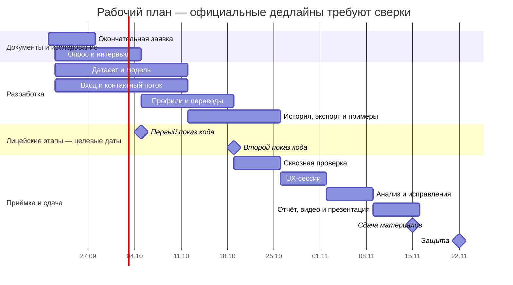

# Календарный план и диаграмма Ганта

Автор: Харченко Богдан Никитич, 11И2. Дата планирования: 21.09.2026.

Это рабочий календарь проекта, а не подтверждённое расписание Лицея. Даты внешних
этапов ниже — целевые точки планирования, подлежащие замене на официальные даты
перед отправкой заявки. План не доказывает, что работы уже выполнены.
Он предполагает возможность параллельно готовить документы, датасет и интерфейс.

| Этап                                                | Начало     | Конец      | Ожидаемый результат                                        |
| --------------------------------------------------- | ---------- | ---------- | ---------------------------------------------------------- |
| Технический фундамент P01–P12, выполнено по журналу | 15.09.2026 | 21.09.2026 | Backend, хранение, правила, внутренние инциденты, карточки |
| Окончательная заявка и согласование изменений       | 21.09.2026 | 27.09.2026 | Заявка, пользовательские сценарии и изменения              |
| Опрос и интервью о проблеме                         | 22.09.2026 | 04.10.2026 | Обезличенное обоснование проблемы и требований             |
| Датасет и базовый классификатор                     | 22.09.2026 | 11.10.2026 | Разметка, разделение, модель и отчёт качества              |
| Вход, сохранение данных и полный контактный поток   | 22.09.2026 | 11.10.2026 | Аккаунты, сообщение/URL, оценка и предупреждение           |
| Первый показ кода, рабочая целевая дата             | 05.10.2026 | 05.10.2026 | first_code.md с фактически выполненным                     |
| Финансовые профили и симулятор переводов            | 05.10.2026 | 18.10.2026 | Проверка и применение решения внутри симулятора            |
| История, экспорт, карточки и каталог примеров       | 12.10.2026 | 25.10.2026 | Полный набор пользовательских возможностей                 |
| Второй показ кода, рабочая целевая дата             | 19.10.2026 | 19.10.2026 | Видео не менее 4–5 работающих пользовательских сценариев   |
| Сквозная проверка и целевая конфигурация            | 19.10.2026 | 25.10.2026 | Приёмка функций, доступа и сохранения данных               |
| Пользовательское исследование                       | 26.10.2026 | 01.11.2026 | Фактические наблюдения по фиксированному протоколу         |
| Анализ результатов и исправления                    | 02.11.2026 | 08.11.2026 | Отчёт с ограничениями, проверенная итоговая сборка         |
| Отчёт, полное видео и презентация                   | 09.11.2026 | 15.11.2026 | Комплект итоговых материалов                               |
| Сдача материалов, рабочая целевая дата              | 15.11.2026 | 15.11.2026 | Зафиксированная версия и проверенные ссылки                |
| Защита, рабочая целевая дата                        | 22.11.2026 | 22.11.2026 | Демонстрация и ответы на вопросы                           |

В таблице конец периода включён; в диаграмме для протяжённых работ конец задан
следующим днём. При переносе внешнего срока необходимо проверить зависимости и
доступное время, а не только сдвинуть одну отметку. Заявленные ранее 6–8 часов в
неделю не являются подтверждённой оценкой достаточности для этого календаря.
